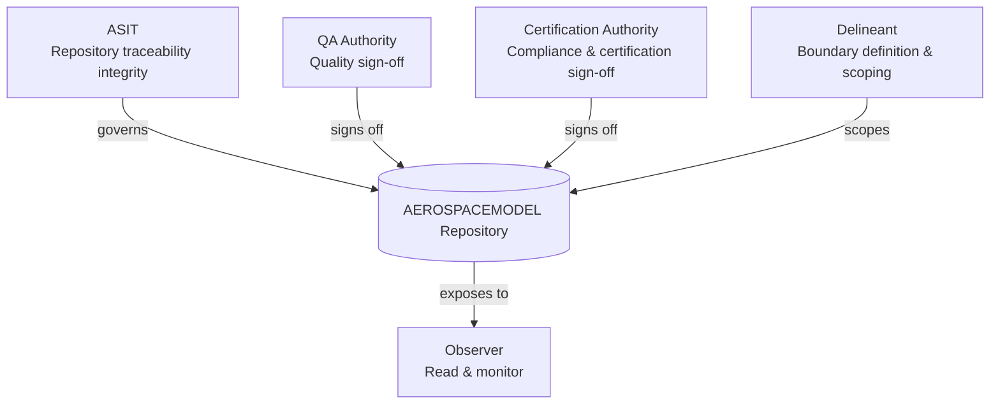
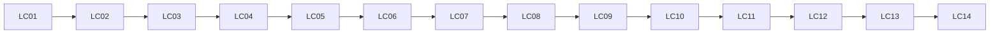
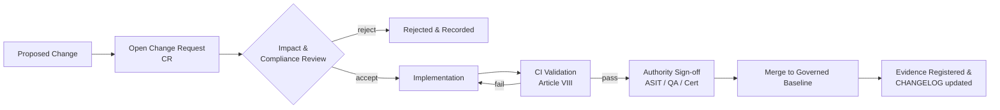
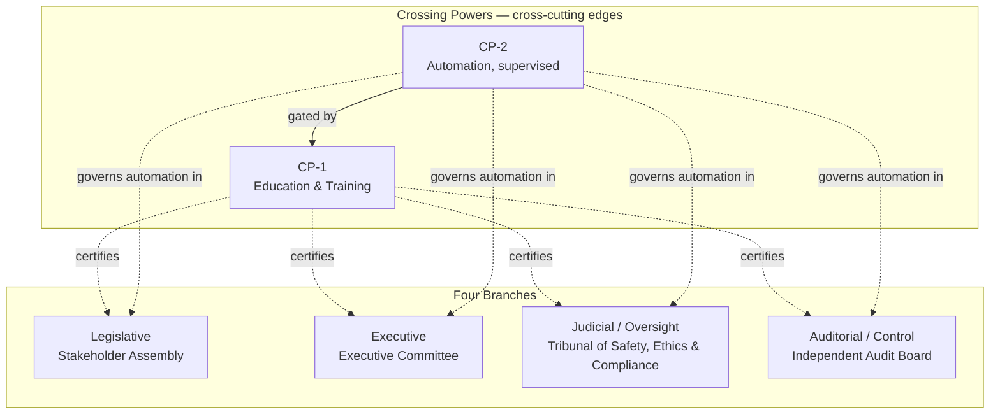
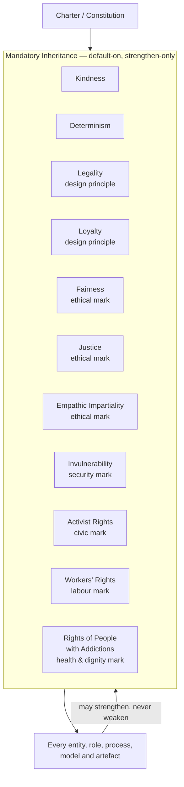

# MODEL DIGITAL CONSTITUTION

**Path:** `MODEL_DIGITAL_CONSTITUTION.md`  
**Authority:** ASIT  
**Scope:** Repository-wide  
**Status:** ACTIVE

---

## Article I — Purpose

This document establishes the foundational governance charter for AEROSPACEMODEL.

AEROSPACEMODEL is a governed digital environment. All content, structure, logic, and automation within this repository is subject to this constitution.

---

## Article II — Governing Principles

1. **Product Primacy** — The product is the primary governed object. All lifecycle, compliance, and traceability logic resolves to a product or variant.

2. **Traceability Completeness** — Every obligation must be traceable from requirement through evidence to signoff. Broken chains are nonconformances.

3. **Single Source of Truth** — Each controlled datum has one authoritative location. Duplication without controlled reference is prohibited.

4. **Machine Readability** — Governance structures, mappings, and evidence must be machine-readable and CI-validatable.

5. **Lifecycle Governance** — All product lifecycle states are governed by the canonical LC01–LC14 phase model.

6. **Standard Binding** — Standards are not narrative references. They are executable compliance subsystems bound to the lifecycle.

7. **Evidence Addressability** — All evidence must be addressable via controlled identifiers and registered in the evidence register.

8. **Audit Integrity** — Audit records must be immutable once signed. Corrections require new records with supersession references.

---

## Article III — Authority Structure

| Role | Responsibility |
|------|---------------|
| ASIT | Repository traceability integrity, structural consistency, lifecycle operating coherence |
| QA Authority | Quality assurance sign-off |
| Certification Authority | Compliance and certification sign-off |
| Observer | Read and monitor access |
| Delineant | Boundary definition and scoping |

---

## Article IV — Controlled Vocabulary

All folder names, status codes, acronyms, and field values used within this repository are controlled vocabulary.

Definitions are maintained in:
- `00_META/glossary/acronyms.md`
- `00_META/glossary/terms.md`
- `00_META/glossary/controlled_vocabulary.yaml`

---

## Article V — Glossary of Terms and Acronyms

The canonical, machine-readable glossaries remain those listed in Article IV (`00_META/glossary/`). This article reproduces the in-document working glossary covering terms and acronyms used in this constitution and in Appendix A (DEGF v1.0).

### V.1 Terms

| Term | Definition |
|------|------------|
| AEROSPACEMODEL | The governed digital environment defined and bound by this constitution. |
| Controlled Vocabulary | The closed set of folder names, status codes, acronyms and field values authorized for use in the repository. |
| Crossing Power | A cross-cutting edge (not a branch) that traverses and unifies the four governance branches; supporting, never sovereign. |
| Evidence | Auditable artefact (record, report, manifest, log, signed package) addressable via a controlled identifier and registered in the evidence register. |
| Lifecycle (LC01–LC14) | The canonical 14-phase product lifecycle phase model under which all lifecycle states are governed. |
| Mandatory Inheritance | Default-on, non-waivable duties (Kindness, Determinism, Legality, Loyalty, Fairness, Justice, Empathic Impartiality, Invulnerability, Activist Rights, Workers' Rights, Rights of People with Addictions) inherited by every entity at creation; strengthen-only, never weakened. |
| Nonconformance | A deviation from a controlled obligation, including broken traceability chains and unauthorized modifications to controlled objects. |
| Product Primacy | The principle that the product is the primary governed object; all lifecycle, compliance and traceability logic resolves to a product or variant. |
| Separation of Powers | Division of authority across the Legislative, Executive, Judicial/Oversight and Auditorial/Control branches. |
| Single Source of Truth | The rule that each controlled datum has exactly one authoritative location; duplication without controlled reference is prohibited. |
| Standard Binding | The treatment of standards as executable compliance subsystems bound to the lifecycle, not as narrative references. |
| Supersession | Recording a correction by issuing a new immutable record that references and supersedes the prior one. |
| Traceability Completeness | The requirement that every obligation be traceable from requirement through evidence to signoff. |

### V.2 Acronyms

| Acronym | Expansion |
|---------|-----------|
| AR | Activist Rights (Civic Mark — Mandatory Inheritance) |
| AS9100D | Aerospace quality management system standard |
| ASIT | Authority for Structural and Integrity Traceability |
| CCT | Conditions Cross-Reference Table (S1000D) |
| CI | Continuous Integration |
| COI | Conflict Of Interest |
| CP-1 | Crossing Power 1 — Education & Training (Unity) |
| CP-2 | Crossing Power 2 — Automation (Supervised Execution) |
| CR | Change Request |
| CSDB | Common Source DataBase (S1000D) |
| D | Determinism (Mandatory Inheritance) |
| DEGF | Democratic Enterprise Governance Framework |
| DO-178C | Software considerations in airborne systems (RTCA) |
| DO-254 | Design assurance for airborne electronic hardware (RTCA) |
| EAP | Employee Assistance Programme |
| EAR | Export Administration Regulations (US) |
| EASA | European Union Aviation Safety Agency |
| EVM | Earned Value Management |
| F | Fairness (Ethical Mark — Mandatory Inheritance) |
| FAA | Federal Aviation Administration (US) |
| GAIA-QAO | GAIA Quantum Aerospace Organisation |
| GDPR | General Data Protection Regulation (EU) |
| HR | Human Resources |
| IE | Imparzialità Empatica / Empathic Impartiality (Ethical Mark — Mandatory Inheritance) |
| IETP | Interactive Electronic Technical Publication |
| ILO | International Labour Organization |
| INV | Invulnerability (Security Mark — Mandatory Inheritance) |
| ITAR | International Traffic in Arms Regulations (US) |
| J | Justice (Ethical Mark — Mandatory Inheritance) |
| K | Kindness (Mandatory Inheritance) |
| KPI | Key Performance Indicator |
| L | Legality and/or Loyalty (Design Principles — Mandatory Inheritance) |
| LC01–LC14 | Canonical 14-phase product lifecycle phase model |
| MLOps | Machine Learning Operations |
| NDA | Non-Disclosure Agreement |
| ORB | Operational Review Board (executive office; sub-ORBs include FIN, LEG, HR) |
| ORB-FIN | ORB — Finance |
| ORB-HR | ORB — Human Resources |
| ORB-LEG | ORB — Legal |
| P&L.inc | Profit & Loss, incorporated (corporate vehicle paired with GAIA-QAO) |
| QA | Quality Assurance |
| Q-CYBERSEC | Q-Division — Cybersecurity |
| Q-DATAGOV | Q-Division — Data Governance |
| Q-HPC | Q-Division — High-Performance Computing |
| Q-SCIRES | Q-Division — Scientific Research |
| Q-SPACE | Q-Division — Space |
| RA | Rights of People with Addictions (Health & Dignity Mark — Mandatory Inheritance) |
| S1000D | International specification for technical publications |
| SBOM | Software Bill of Materials |
| SLAPP | Strategic Lawsuit Against Public Participation |
| SLA | Service Level Agreement |
| TMC | Training Master Class |
| UTCS | Universal Traceability and Configuration System |
| WR | Workers' Rights (Labour Mark — Mandatory Inheritance) |

---

## Article VI — Diagrams

The following diagrams render the structures described in Articles I–V and Appendix A. They are normative for shape (relationships and direction) and informative for layout.

### VI.1 Authority Structure (Article III)

### VI.2 Lifecycle Phase Model LC01–LC14 (Article II §5)

### VI.3 Change Control Workflow (Article VII)

### VI.4 DEGF — Separation of Powers and Crossing Powers (Appendix A §5.3)

### VI.5 Mandatory Inheritance (Appendix A §5.2.1)

---

## Article VII — Change Control

All changes to controlled objects require a Change Request (CR) processed through `01_GOVERNANCE/workflows/change_request_workflow.md`.

Unauthorized modifications to controlled objects are nonconformances.

---

## Article VIII — Validation and CI

The repository CI pipeline (`08_AUTOMATION/ci/pipeline.yaml`) is the enforcement mechanism for structural and semantic integrity.

CI validation is mandatory before any merge to a governed baseline branch.

---

## Article IX — Compliance

This constitution shall be reviewed at each major release. Amendments require ASIT approval and are recorded in `CHANGELOG.md`.

---

## Appendix A — Paragraph 5 from Repository Root README

_Sourced verbatim from `README.md` §5 (Democratic Enterprise Governance Framework) at the repository root, incorporated here per issue request to bind it under the Model Digital Constitution._

# 5. Democratic Enterprise Governance Framework

## 5.1 Purpose

The **Democratic Enterprise Governance Framework (DEGF) v1.0** defines the organizational constitution, stakeholder rights, accountability structures and decision mechanisms for GAIA-QAO / P&L.inc.

It is designed to distribute authority while preserving non-negotiable constraints required by aerospace and quantum-critical systems:

- safety;
- certification;
- regulatory compliance;
- financial discipline;
- export control;
- data security;
- technical authority.

## 5.2 Constitutional Principles

| Principle | Enterprise Translation |
|---|---|
| Supremacy of the Charter | All policies, budgets and strategic decisions derive authority from the corporate constitution. |
| No Kings, No Queens, No Dynasties | Authority is elected, appointed or merit-certified; no hereditary or dynastic role exists. |
| Safety as Constitutional Law | Airworthiness and certification cannot be overridden by popularity or internal politics. |
| Transparency by Default | Non-classified financials, KPIs, risk registers and governance records are visible to approved stakeholders. |
| Subsidiarity | Decisions are made at the lowest competent level within controlled baselines. |
| Amendment Discipline | Constitutional amendments require stakeholder approval, division ratification and compliance review. |
| Kindness (Mandatory Inheritance) | Every entity, role, process, model and artefact inherits a non-waivable duty of kindness — humane, respectful and non-harmful conduct toward people, ecosystems and machines. |
| Determinism (Mandatory Inheritance) | Every entity, role, process, model and artefact inherits a non-waivable duty of determinism — reproducible inputs, versioned configurations, declared seeds/parameters and auditable, repeatable outputs. |
| Legality (Mandatory Inheritance — Design Principle) | Every entity, role, process, model and artefact inherits a non-waivable duty of legality — designed, operated and evolved within applicable laws, regulations, certifications, treaties, licences and the corporate charter; "design-by-legality" is mandatory at architecture time, not retrofitted. |
| Loyalty (Mandatory Inheritance — Design Principle) | Every entity, role, process, model and artefact inherits a non-waivable duty of loyalty — fidelity to the charter, to stakeholders, to safety, to truthful disclosure and to declared interests; absence of hidden allegiances, undisclosed conflicts of interest or covert side-channels. |
| Fairness (Mandatory Inheritance — Ethical Mark) | Every entity, role, process, model and artefact inherits a non-waivable duty of fairness — equal treatment, absence of unjustified bias or discrimination, proportionality of burdens and benefits, accessibility, and equitable participation across stakeholders, regions, languages and protected groups. |
| Justice (Mandatory Inheritance — Ethical Mark) | Every entity, role, process, model and artefact inherits a non-waivable duty of justice — due process, right to be heard, proportional remedy, fair distribution of risk and reward, redress for harm, and consistency between stated rules and applied decisions. |
| Imparzialità Empatica / Empathic Impartiality (Mandatory Inheritance — Ethical Mark) | Every entity, role, process, model and artefact inherits a non-waivable duty of *imparzialità empatica* — the synthesis of Kindness with Fairness and Justice: decisions are made without favouritism or partiality, while actively understanding and weighing each party's lived perspective, vulnerability and context; impartial in rule, empathic in application. |
| Invulnerability (Mandatory Inheritance — Security Mark) | Every entity, role, process, model and artefact inherits a non-waivable duty of invulnerability — designed resilience against attack, tampering, coercion, compromise and single-point failures: defence-in-depth, least privilege, zero-trust boundaries, redundancy, integrity protection, graceful degradation and verifiable recovery; "no single point of compromise". |
| Activist Rights (Mandatory Inheritance — Civic Mark) | Every entity, role, process, model and artefact inherits a non-waivable duty to recognise and protect *activist rights* — the right of stakeholders, workers, users, communities and conscientious objectors to dissent, organise, raise concerns, blow the whistle, peacefully protest, refuse complicity in unlawful or unethical acts, and seek redress, without retaliation, surveillance, deplatforming or career penalty. |
| Workers' Rights (Mandatory Inheritance — Labour Mark) | Every entity, role, process, model and artefact inherits a non-waivable duty to uphold *every worker's rights* — for every worker touched by the enterprise (employees, contractors, sub-contractors, platform/gig, agency, interns, supply-chain and subcontracted labour): freedom of association and collective bargaining; freedom from forced, bonded and child labour; non-discrimination and equal pay for equal work; safe and healthy working conditions; fair living wage and on-time payment; regulated working hours, rest, leave and parental rights; privacy and dignity at work (including limits on surveillance and algorithmic management); right to information, training and skills development; protection from harassment and reprisals; right to disconnect; portability of benefits; and meaningful voice in decisions that affect work. |
| Rights of People with Addictions (Mandatory Inheritance — Health & Dignity Mark) | Every entity, role, process, model and artefact inherits a non-waivable duty to recognise people affected by substance-use disorders and behavioural addictions as bearers of full rights — treating addiction as a health condition, not a moral failing or grounds for exclusion. This includes: non-discrimination in employment, services and access; confidentiality of health information; right to evidence-based treatment, harm reduction, recovery and reintegration support; reasonable workplace accommodations and protected leave for treatment; dignified, non-stigmatising language and imagery; refusal to deploy products, designs or business models that knowingly exploit addictive vulnerabilities (dark patterns, predatory engagement loops, targeting of people in recovery); and protection from coercive surveillance, profiling or punitive automation that targets this population. |

### 5.2.1 Mandatory Inheritance — Kindness, Determinism, Legality, Loyalty, Fairness, Justice, Empathic Impartiality, Invulnerability, Activist Rights, Workers' Rights & Rights of People with Addictions (Design-by-K/D/L/L + F/J + IE + INV + AR + WR + RA)

Kindness, Determinism, Legality, Loyalty, Fairness, Justice, Imparzialità Empatica (Empathic Impartiality, IE), Invulnerability (INV), Activist Rights (AR), Workers' Rights (WR) and Rights of People with Addictions (RA) are declared as **mandatory inheritance form**. Kindness & Determinism are the operating duties; Legality & Loyalty are **design principles** ("Design by Legality and Loyalty"); Fairness, Justice and Empathic Impartiality are **ethical marks**; Invulnerability is the **security mark**; Activist Rights is the **civic mark**; Workers' Rights is the **labour mark**; Rights of People with Addictions is the **health & dignity mark** that every entity must visibly bear and be assessable against. All eleven are inherited by default by every node of the enterprise (branches, crossing powers, divisions, programmes, ORBs, Q-Divisions, ATA chapters, OPT-INS axes, automations, models and artefacts), must be *designed in* from the earliest architectural decision, and cannot be opted out of, overridden or weakened by any descendant.

| Inherited Trait | Definition | Enforcement | Override |
|---|---|---|---|
| Kindness | Humane, respectful, non-harmful conduct toward people, ecosystems and machines; preference for de-escalation, dignity and care; refusal to produce or execute outputs that demean, endanger or exploit. | Charter & ethics certification under CP-1 (Education & Training); ethics review under Q-DATAGOV / ORB-LEG; pre-deployment evaluation under CP-2 (Automation) blocks releases that fail kindness checks. | None. May be made stricter by descendants; never weakened. |
| Determinism | Reproducible behaviour: declared inputs, pinned versions, recorded seeds and parameters, content-addressed artefacts, repeatable evaluation; non-deterministic components must be explicitly marked, bounded and logged. | UTCS/S1000D evidence chain, CSDB applicability, signed manifests (e.g. .finex packages), CI reproducibility checks under CP-2; audit trail under the Auditorial / Control branch. | None. May be made stricter by descendants; never weakened. |
| Legality (Design Principle) | Compliance is a design input, not a deliverable: applicable laws, regulations (EASA/FAA/ITAR/EAR/GDPR/AI Act/export control etc.), certifications, treaties, licences and the corporate charter are encoded as architectural constraints, requirements and gates from inception. | ORB-LEG legality review at design start and at every major gate; regulatory traceability through UTCS/S1000D evidence chain; CP-2 automated policy/licence/export checks; Auditorial / Control attestation of compliance posture. | None. Stricter requirements may be added; the legal baseline cannot be relaxed. Apparent legal/safety conflicts are escalated to Judicial / Oversight, never resolved by silently lowering compliance. |
| Loyalty (Design Principle) | Architectures, processes and artefacts are designed to be faithful to declared purpose, stakeholders and interests: no hidden backdoors, no undeclared data flows, no covert telemetry, no undisclosed conflicts of interest; allegiance is to the charter and to safety, in this order. | Conflict-of-interest declarations and recusal procedures under ORB-LEG; supply-chain and code provenance via SBOM/signed artefacts; review of data flows, telemetry and external dependencies under CP-2; whistleblower channel and Judicial / Oversight handling of breaches. | None. Stricter loyalty controls (e.g. stronger COI rules, tighter data residency) may be added; never weakened. |
| Fairness (Ethical Mark) | Equal treatment, absence of unjustified bias or discrimination, proportionality of burdens and benefits, accessibility (language, ability, region), and equitable participation; comparable cases are treated comparably and differences are justified, documented and reviewable. | Bias and disparate-impact evaluation under CP-2 (datasets, models, decision systems); accessibility and inclusion review under ORB-LEG / Q-DATAGOV; participation and representation checks at gates; Auditorial / Control review of fairness evidence. | None. Stricter fairness criteria may be added; never weakened. Detected unfairness suspends release until remediated. |
| Justice (Ethical Mark) | Due process, right to be heard, proportional remedy, fair distribution of risk and reward, redress for harm, and consistency between stated rules and applied decisions; published procedures for contestation and appeal. | Documented appeal/contestation paths owned by Judicial / Oversight; harm and remedy register; consistency audits comparing stated rules to actual decisions under the Auditorial / Control branch; whistleblower and grievance channels under ORB-LEG. | None. Stricter justice guarantees (e.g. shorter response times, broader standing) may be added; never weakened. |
| Imparzialità Empatica (Ethical Mark) | Synthesis of impartial rule-application and empathic understanding of context: rules are applied without favouritism, partiality or arbitrariness, while the decision actively considers each party's perspective, vulnerability, capability and circumstances; impartial in form, empathic in substance. | Decision-making templates that require both an impartiality check (consistency, absence of conflict-of-interest, comparable treatment of comparable cases) and an empathy check (stakeholder perspective, accessibility, affected vulnerable groups); review under Q-DATAGOV / ORB-LEG; CP-1 training in empathic impartiality for adjudicators and operators; CP-2 enforcement in automated decisions; Auditorial / Control sampling of decisions for both axes. | None. Stricter empathic-impartiality criteria (e.g. mandatory perspective-taking artefacts, panel diversity) may be added; never weakened. |
| Invulnerability (Security Mark) | Designed resilience against attack, tampering, coercion, compromise and single-point failures: defence-in-depth, least privilege, zero-trust boundaries, segregation of duties, redundancy and diversity, integrity protection (signing, attestation, immutable evidence), graceful degradation, verifiable backup and recovery, and protection against insider, supply-chain and physical threats. Safety-of-life functions remain dual-controlled and never become a single point of compromise. | Threat-modelling and security architecture review at every gate under Q-CYBERSEC / ORB-LEG; SBOM, signed artefacts and provenance under CP-2; least-privilege and zero-trust enforcement; red-team / penetration testing and chaos/resilience exercises; incident-response plan and verified recovery drills; Auditorial / Control attestation of security and resilience posture; coordinated disclosure channel. | None. Stricter invulnerability controls (e.g. higher assurance levels, stronger redundancy, broader threat model) may be added; never weakened. Discovered vulnerabilities trigger remediation under defined SLAs and, where safety-relevant, Judicial / Oversight review. |
| Activist Rights (Civic Mark) | Recognition and active protection of dissent, organising, whistleblowing, peaceful protest, conscientious objection, refusal of complicity in unlawful or unethical acts, and right to seek redress — for stakeholders, workers, users and affected communities. No retaliation, surveillance, deplatforming, blacklisting, SLAPP-style litigation, NDA misuse or career penalty for good-faith exercise of these rights; anonymous and identified channels both supported; protections extend to externals raising concerns about the enterprise's products or operations. | Whistleblower and grievance channels with anti-retaliation guarantees under ORB-LEG and Judicial / Oversight; conscientious-objection procedures under CP-1; ban on surveillance of lawful organising and on NDAs that suppress reporting of illegality, safety risks or rights violations; Auditorial / Control review of retaliation indicators (terminations, transfers, access revocations correlated with reports); coordinated disclosure and bug-bounty paired with safe-harbour for security researchers. | None. Stricter activist-rights protections (e.g. broader anti-retaliation scope, shorter response SLAs, expanded standing for community advocates) may be added; never weakened. Any retaliation is itself a breach and triggers Judicial / Oversight review. |
| Workers' Rights (Labour Mark) | Every worker — direct, contractor, sub-contractor, agency, intern, platform/gig and supply-chain — is entitled to: freedom of association and collective bargaining; freedom from forced, bonded and child labour; non-discrimination, equal opportunity and equal pay for work of equal value; safe and healthy workplaces (physical, psychological and digital); fair living wage with on-time, traceable payment; regulated working hours, paid rest, leave, parental and care rights; privacy, dignity and limits on workplace and algorithmic surveillance; transparent, contestable algorithmic management decisions (assignment, evaluation, discipline, dismissal); right to information, training, reskilling and skills portability when automation reshapes work; protection from harassment, mobbing and reprisals; right to disconnect outside working hours; meaningful voice in decisions affecting work and workplace health. | Labour-rights baseline anchored on ILO core conventions, applicable national labour law and the EU/UN business-and-human-rights framework, enforced via ORB-LEG; works councils / worker-representation bodies and recognised trade-union dialogue under CP-1; supplier code of conduct with audited human-rights and labour-rights due diligence (incl. forced/child labour, wage and hours) across the supply chain under CP-2; algorithmic management transparency, impact assessment and contestation paths under Q-DATAGOV; pay-equity audits, health-and-safety management system and worker grievance channels with anti-retaliation guarantees; Auditorial / Control attestation of labour-rights posture and supply-chain compliance. | None. Stricter workers'-rights protections (e.g. higher floor wage, shorter hours, stronger surveillance limits, broader supply-chain due diligence) may be added; never weakened. Verified violations (especially forced labour, child labour, wage theft, unsafe conditions or union-busting) trigger immediate remediation and Judicial / Oversight review, and may suspend the offending operation or supplier. |
| Rights of People with Addictions (Health & Dignity Mark) | Addiction (substance-use disorders and recognised behavioural addictions) is treated as a health condition. Affected people retain full rights and dignity, with: non-discrimination in hiring, retention, promotion, services and access; confidentiality of health and treatment information (no unnecessary disclosure, no sale or sharing of such data); right to evidence-based treatment, harm-reduction options and recovery support; reasonable workplace accommodations (e.g. flexible scheduling for treatment, protected medical leave, return-to-work plans); ban on coercive or punitive testing beyond what is strictly necessary for safety-critical roles and proportionate, lawful and transparent; non-stigmatising language and imagery in all communications and training; and a design prohibition on products, services, models or business practices that knowingly exploit addictive vulnerabilities (dark patterns, predatory engagement loops, micro-transactions targeted at vulnerable users, advertising targeted at people in recovery). | Health-condition recognition and accommodation procedures under ORB-LEG and Q-DATAGOV (privacy of health data); Employee Assistance Programme and harm-reduction-aware support under CP-1; design and product reviews under CP-2 to detect and block addictive dark patterns, exploitative engagement metrics and targeting of vulnerable populations; safety-critical testing programmes proportionate, transparent, with right to representation and appeal; partnerships with public-health and recovery organisations; Auditorial / Control review of accommodation outcomes and product-design audits; whistleblower channel for stigma, discrimination or exploitative-design concerns. | None. Stricter protections (e.g. broader accommodation, deeper product-design audits, stricter limits on engagement metrics) may be added; never weakened. Discrimination, breach of health-data confidentiality, exploitation of addictive vulnerabilities or punitive non-safety testing trigger immediate remediation and Judicial / Oversight review. |

**Inheritance rules**

- **Default-on, non-waivable** — every new entity inherits all eleven traits at creation; no charter, policy, contract or automation may disable them.
- **Design-time, not retrofit** — Legality, Loyalty, Fairness, Justice, Empathic Impartiality, Invulnerability, Activist Rights, Workers' Rights and Rights of People with Addictions (together with Kindness & Determinism) must be addressed in the earliest design artefacts (problem statement, architecture, interfaces, threat model, grievance & whistleblower paths, labour-impact assessment, addictive-pattern / vulnerable-user impact assessment) and re-checked at every gate; "design by legality and loyalty", the ethical, security, civic, labour and health & dignity marks are preconditions for approval, not closing items.
- **Strengthen-only** — descendants may impose stricter kindness, determinism, legality, loyalty, fairness, justice, empathic-impartiality, invulnerability, activist-rights, workers'-rights or rights-of-people-with-addictions requirements, but never relax the inherited baseline.
- **Coupled with crossing powers** — CP-1 certifies operators, supervisors, adjudicators, security personnel, managers and HR/EAP staff on these duties (including stigma-free handling of addiction, harm reduction, accommodation and worker representation); CP-2 enforces them in automated workflows (kindness/safety/bias/fairness/empathic-impartiality evaluations, reproducibility gates, policy/licence/export checks, provenance and conflict-of-interest checks, appeal-path verification, security/integrity attestation, retaliation-pattern detection, supplier human-rights and labour-rights due diligence, algorithmic-management transparency, and detection/blocking of addictive dark patterns and vulnerable-user exploitation).
- **Evidence-based** — adherence is recorded as auditable artefacts (training records, evaluation reports, reproducibility logs, signed manifests, SBOMs, COI registers, regulatory mappings, fairness/bias reports, appeal and remedy registers, impartiality + empathy decision records, threat models, pen-test reports, incident-response and recovery records, whistleblower/grievance intake and outcome registers, retaliation-monitoring reports, pay-equity audits, health-and-safety records, supplier human-rights/labour-rights due-diligence reports, worker-voice records, accommodation registers, addictive-pattern design-audit reports and health-data privacy attestations) available to the Auditorial / Control branch.
- **Ethical-, security-, civic-, labour- and health & dignity-mark visibility** — every entity must publish a concise Fairness, Justice, Empathic-Impartiality, Invulnerability, Activist-Rights, Workers'-Rights & Rights-of-People-with-Addictions statement (criteria used, evaluation method, contestation channel, vulnerability-disclosure channel, whistleblower/grievance channel, worker-representation and supplier due-diligence summary, accommodation and EAP overview, addictive-pattern audit summary, and anti-retaliation guarantees) so its marks are externally assessable.
- **Breach handling** — a verified breach of any of the eleven traits suspends the offending authority, automation, product feature or supplier relationship until remediated; repeated or wilful breaches, and any legality, loyalty, fairness, justice, empathic-impartiality, invulnerability, activist-rights, workers'-rights or addiction-related-rights breach with safety, stakeholder, rights, labour or health impact, trigger Judicial / Oversight review.

## 5.3 Separation of Powers

| Branch | Corporate Equivalent | Authority |
|---|---|---|
| Legislative | Stakeholder Assembly | Strategy, budget oversight, executive confirmation, charter amendments |
| Executive | Executive Committee | Programme execution, operations, resource allocation |
| Judicial / Oversight | Independent Tribunal of Safety, Ethics & Compliance | Compliance disputes, safety halts, whistleblower protection, ethical breaches |
| Auditorial / Control | Independent Audit Board (Office of the Auditor General) | Independent financial, operational, performance and compliance audits; internal control assurance; attestation of accounts and KPIs; fraud and waste investigations; reporting to the Stakeholder Assembly |

### 5.3.1 Crossing Powers (Cross-Cutting Edges)

Crossing Powers are not branches; they are **cross-cutting edges** that traverse and unify the four branches (Legislative, Executive, Judicial/Oversight, Auditorial/Control). They are the constitutional mechanisms that keep all powers competent, aligned and accountable to the same body of knowledge, ethics, safety and operational doctrine.

| # | Crossing Power | Mode | Corporate Equivalent | Authority | Unifies |
|---|---|---|---|---|---|
| 1 | Education & Training (Unity) | Supporting · human-led | Corporate Academy & TMC (Training Master Class) — under Q-SCIRES / ORB-HR with Q-DATAGOV curriculum governance | Charter and ethics literacy; mandatory induction and recurrent training for all branches; certification of competencies (safety, compliance, audit, leadership); curriculum stewardship; cross-branch knowledge exchange; learning records and revocation of certifications when standards are breached | Legislative · Executive · Judicial/Oversight · Auditorial/Control |
| 2 | Automation (Supervised Execution) | Supporting · supervised | Office of Automation & Digital Operations — under Q-DATAGOV with Q-SCIRES (MLOps), Q-HPC (compute) and ORB-LEG (assurance); always under a designated human supervisor from the relevant branch | Workflow, decision-support and robotic/process automation across branches; MLOps and model lifecycle governance; human-in-the-loop and human-on-the-loop controls; explainability, bias and safety evaluations; deterministic audit trails of automated actions; emergency stop and rollback; deployment gating against Education & Training certifications | Legislative · Executive · Judicial/Oversight · Auditorial/Control |

**Operating principles**

- **Supporting, not sovereign** — crossing powers serve the four branches; they do not legislate, execute, judge or audit on their own authority.
- **Mandatory for all branches** — every branch consumes both crossing powers: members must hold current certifications (CP-1) and any automated tooling they rely on must be governed by CP-2.
- **Independent governance** — curricula and automation policies are governed jointly so that no single branch can shape its own training or its own automation to its advantage.
- **Supervised by design** — every automated action runs under a named human supervisor from the owning branch, with documented human-in-the-loop or human-on-the-loop controls and a working emergency stop.
- **Evidence-based** — training events, certifications, model versions, prompts, decisions and overrides are recorded as auditable artefacts available to the Auditorial branch.
- **Coupled controls** — CP-2 deployments are gated by CP-1 certifications: operators and supervisors must be currently certified for the workflow being automated.
- **No override of safety or ethics** — loss or suspension of a required certification suspends the holder's authority; failed safety, bias or compliance evaluations suspend the automation until remediated.
- **Continuity and unity** — common doctrine, vocabulary, safety culture and operational primitives are propagated across branches, divisions and programmes, preserving institutional unity across mandates and generations.

## 5.4 Safety and Certification Guardrails

| Guardrail | Mechanism | Override |
|---|---|---|
| Safety Veto | CTO + independent oversight authority | None |
| Regulatory Supremacy | EASA / FAA / AS9100D / DO-178C / DO-254 / ISO controls | None |
| Fiduciary Discipline | ORB-FIN + independent audit | No override if solvency or EVM thresholds are breached |
| Export Control | ORB-LEG + Q-DATAGOV + Q-SPACE | No unauthorized release |

---
