# 03-I-00-00-00 — Support Infrastructure: General

**ATA Code:** 03-I-00-00-00  
**Programme:** AMPEL360 Q100 · GAIA-SPACE-LAUNCHER · SPACET Q10  
**OPT-IN Axis:** I — Infrastructures  
**Domain:** I-INFRASTRUCTURES  
**Chapter:** ATA_03-SUPPORT_INFRA  
**Status:** ✅ Active  

---

## 1. Overview

This node defines the **general support infrastructure** for ATA Chapter 03 within the I-INFRASTRUCTURES axis.
It serves as the root node for all support-infrastructure sub-topics, covering scope, baselines, operations,
facilities, utilities, safety, security, data interoperability, human factors, maintenance, sustainability,
compliance, and governance.

---

## 2. Node Breakdown — Mermaid (native)

```mermaid
flowchart TD
    A["03-I-00-00-00<br/>general"]
    B01["03-I-00-01-00<br/>purpose_scope"]
    B02["03-I-00-02-00<br/>reference_baseline"]
    B03["03-I-00-03-00<br/>operational_concept"]
    B04["03-I-00-04-00<br/>site_facility_framework"]
    B05["03-I-00-05-00<br/>common_utilities_services"]
    B06["03-I-00-06-00<br/>safety_emergency_framework"]
    B07["03-I-00-07-00<br/>security_access_control"]
    B08["03-I-00-08-00<br/>data_digital_interoperability"]
    B09["03-I-00-09-00<br/>human_factors_documentation"]
    B10["03-I-00-10-00<br/>maintenance_supportability"]
    B11["03-I-00-11-00<br/>environmental_sustainability"]
    B12["03-I-00-12-00<br/>compliance_certification"]
    B13["03-I-00-13-00<br/>configuration_governance_performance"]

    A --> B01
    A --> B02
    A --> B03
    A --> B04
    A --> B05
    A --> B06
    A --> B07
    A --> B08
    A --> B09
    A --> B10
    A --> B11
    A --> B12
    A --> B13
```

---

## 3. Breakdown Table

| Code             | Title                                | Description                                                        |
|------------------|--------------------------------------|--------------------------------------------------------------------|
| `03-I-00-01-00`  | purpose_scope                        | Purpose and scope of the support infrastructure chapter            |
| `03-I-00-02-00`  | reference_baseline                   | Reference documents, standards, and baseline configurations        |
| `03-I-00-03-00`  | operational_concept                  | Operational concept for infrastructure usage and logistics         |
| `03-I-00-04-00`  | site_facility_framework              | Site layout, facility definitions, and physical framework          |
| `03-I-00-05-00`  | common_utilities_services            | Shared utilities and services (power, water, HVAC, networks)       |
| `03-I-00-06-00`  | safety_emergency_framework           | Safety protocols, emergency procedures, and risk mitigation        |
| `03-I-00-07-00`  | security_access_control              | Physical and logical security, access management                   |
| `03-I-00-08-00`  | data_digital_interoperability        | Data standards, digital integration, and interoperability layers   |
| `03-I-00-09-00`  | human_factors_documentation          | Human factors engineering and documentation standards              |
| `03-I-00-10-00`  | maintenance_supportability           | Maintenance planning and supportability framework                  |
| `03-I-00-11-00`  | environmental_sustainability         | Environmental impact management and sustainability practices       |
| `03-I-00-12-00`  | compliance_certification             | Regulatory compliance and certification processes                  |
| `03-I-00-13-00`  | configuration_governance_performance | Configuration management, governance, and performance monitoring   |

---

## 4. Static Assets

### 4.1 SVG Diagram

📐 View SVG — 03-I-00-00-00-general

<object type="image/svg+xml" data="assets/diagrams/03-I-00-00-00-general.svg" width="100%">
  
</object>

### 4.2 PNG Diagram

🖼️ View PNG — 03-I-00-00-00-general

### 4.3 Video Walkthrough

🎬 View Video — 03-I-00-00-00-general

> **Note:** Click the thumbnail above to play the local video walkthrough.
> The video file is located at `assets/media/03-I-00-00-00-general.mp4`.

---

## 5. Expandable Engineering View

🔧 Engineering Detail — Full Node Breakdown

### 5.1 purpose_scope (`03-I-00-01-00`)

Defines the objectives, boundaries, and intended use of the ATA 03 support infrastructure.
Covers applicability across AMPEL360, GAIA-SPACE-LAUNCHER, and SPACET Q10 programmes.

### 5.2 reference_baseline (`03-I-00-02-00`)

Lists normative and informative references: ATA iSpec 2200, S1000D, ISO 55001, and
programme-specific baselines. Maintains version-controlled reference register.

### 5.3 operational_concept (`03-I-00-03-00`)

Describes the operational philosophy including ground handling flows, turnaround scenarios,
resource allocation, and interface with flight operations.

### 5.4 site_facility_framework (`03-I-00-04-00`)

Covers physical site layout, building classifications, ramp/apron zones, hangar allocations,
and facility lifecycle management.

### 5.5 common_utilities_services (`03-I-00-05-00`)

Shared infrastructure services: electrical power distribution, compressed air, potable/grey
water, HVAC, IT/OT networks, fuel supply, and waste management.

### 5.6 safety_emergency_framework (`03-I-00-06-00`)

Safety management system for ground infrastructure, emergency response plans, fire protection,
HAZMAT handling, and occupational health protocols.

### 5.7 security_access_control (`03-I-00-07-00`)

Physical security perimeters, electronic access control systems (EACS), CCTV, intrusion
detection, personnel vetting, and cybersecurity for OT systems.

### 5.8 data_digital_interoperability (`03-I-00-08-00`)

Data exchange standards (S1000D CSDB, ASD/AIA), IoT sensor integration, BIM/digital-twin
interoperability, and API governance for infrastructure systems.

### 5.9 human_factors_documentation (`03-I-00-09-00`)

Ergonomic design criteria, signage and marking standards, training documentation,
and human-machine interface specifications for ground support equipment.

### 5.10 maintenance_supportability (`03-I-00-10-00`)

Preventive and corrective maintenance plans, reliability-centred maintenance (RCM),
spare-parts management, and supportability analysis methodology.

### 5.11 environmental_sustainability (`03-I-00-11-00`)

Environmental impact assessments, carbon-footprint tracking, circular-economy practices,
waste reduction targets, and green infrastructure certifications.

### 5.12 compliance_certification (`03-I-00-12-00`)

Regulatory framework mapping (EASA, FAA, national CAAs), certification milestones,
audit schedules, and compliance evidence management.

### 5.13 configuration_governance_performance (`03-I-00-13-00`)

Configuration management board (CMB) processes, change control, KPI dashboards,
SLA definitions, and continuous improvement governance.

---

## 6. Related Files

| File | Purpose |
|------|---------|
| [`03-I-00-00-00-general.yml`](03-I-00-00-00-general.yml) | SSOT structural definition |
| [`assets/diagrams/03-I-00-00-00-general.mmd`](assets/diagrams/03-I-00-00-00-general.mmd) | Mermaid source diagram |
| [`assets/diagrams/03-I-00-00-00-general.svg`](assets/diagrams/03-I-00-00-00-general.svg) | Rendered SVG (auto-generated) |
| [`assets/images/03-I-00-00-00-general.png`](assets/images/03-I-00-00-00-general.png) | Rendered PNG (auto-generated) |
| [`assets/media/03-I-00-00-00-general.mp4`](assets/media/03-I-00-00-00-general.mp4) | Video walkthrough (local asset) |

---

*Auto-generated assets (SVG, PNG) are produced by the [`validate_ata03_general`](../../.github/workflows/validate_ata03_general.yml) workflow.*
