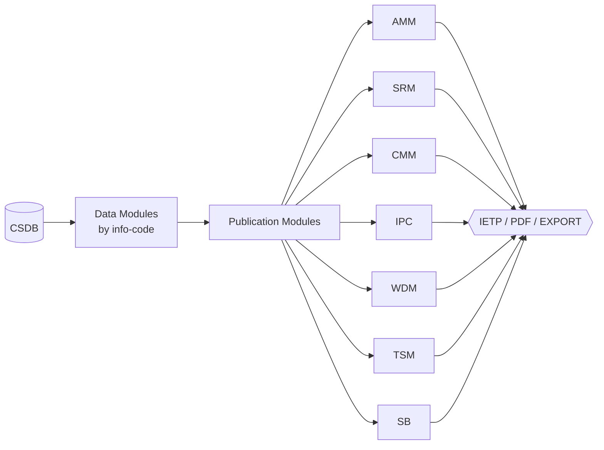

# ATLAS 000-009 · Section 00 · Subsection 030 · Subsubject 01 — Publication Set and Manual Map

## 1. Purpose

Defines the **publication set and manual map** for ATLAS `000-009.030` *documentación general*: the authoritative inventory of technical manuals (AMM, SRM, CMM, IPC, WDM, TSM, SB, AFM, FCOM, …) produced from the Common Source DataBase (CSDB) and the mapping from each manual to its source S1000D info-codes and ATA iSpec 2200 chapters[^ata2200][^s1000d], in conformance with the controlled Q+ATLANTIDE baseline[^baseline].

## 2. Scope

- Covers the *Publication Set and Manual Map* subsubject (`01`) of subsection `030` *documentación general*.
- Inherits Q-Division authority and ORB support from the parent row in [`../../README.md` §3](../../README.md#3-architecture-table)[^archtable].
- Artefact classes in scope: **manual inventory** (AMM, SRM, CMM, IPC, WDM, TSM, SB, AFM, FCOM, …), **manual ↔ info-code map**, **manual ↔ ATA chapter map**, **delivery formats** (IETP, PDF, EXPORT package).
- Aligned with ATA iSpec 2200 / Spec 100 publication conventions[^ata2200][^ataspec100], S1000D Issue 6.0 publication-module rules[^s1000d] and AS9100D quality controls[^as9100d].

## 3. Diagram

The diagram below shows how Data Modules in the CSDB feed Publication Modules that, in turn, assemble the standard manual set delivered as IETP, PDF and EXPORT packages.

## 4. Footprint

| Metric | Value |
|---|---|
| Architecture | `ATLAS` — Aircraft Top-Level Architecture System |
| Master range | `000–099` |
| Code range | `000-009` |
| Section | `00` — Información General y Servicio |
| Subject | `00` — General Information |
| Subsection | `030` — documentación general |
| Subsubject | `01` — Publication Set and Manual Map |
| Primary Q-Division | Q-DATAGOV[^qdiv] |
| Support Q-Divisions | Q-GROUND, Q-AIR |
| ORB support | ORB-PMO, ORB-LEG |
| Governance class | `baseline`[^gov] |
| Folder path | `Q+ATLANTIDE/000-099_ATLAS/000-009_Informacion-General-y-Servicio/030_documentacion-general/` |
| Document | `01_Publication-Set-and-Manual-Map.md` (this file) |
| Parent subsection | [`00_Overview.md`](./00_Overview.md) |
| Parent architecture | [`../../README.md`](../../README.md) |
| Parent baseline | [`organization/Q+ATLANTIDE.md`](../../../../organization/Q+ATLANTIDE.md) |

## 5. References & Citations

[^baseline]: **Q+ATLANTIDE controlled baseline (v1.0.0)** — [`organization/Q+ATLANTIDE.md`](../../../../organization/Q+ATLANTIDE.md). Defines the controlled `000-999` architecture-band taxonomy and the ATLAS-1000 register subpart.

[^archtable]: **ATLAS §3 Architecture Table** — [`../../README.md` §3](../../README.md#3-architecture-table). Authoritative source for the `000-009` row (Section `00` — Información General y Servicio, Primary Q-Division Q-DATAGOV).

[^qdiv]: **Q-Division authority** — Q-Divisions provide technical authority over an architecture row (Q+ATLANTIDE Note N-002). See [`organization/Q+ATLANTIDE.md` §4](../../../../organization/Q+ATLANTIDE.md#4-notes).

[^gov]: **Governance class** — Bands are classified as `baseline` or `restricted` per Q+ATLANTIDE §4 governance rules.

[^ata2200]: **ATA iSpec 2200 — Information Standards for Aviation Maintenance** — Industry standard for digital aircraft maintenance information; governs chapter / section / subject numbering inherited by ATLAS `000-099`.

[^ataspec100]: **ATA Spec 100 — Manufacturers' Technical Data** — Predecessor numbering scheme that established the 00–99 chapter map mirrored by ATLAS sub-ranges.

[^s1000d]: **S1000D Issue 6.0 — International specification for technical publications** — Common Source DataBase (CSDB) and Data Module Code (DMC) specification used across ATLAS technical publications.

[^as9100d]: **AS9100D — Quality Management Systems — Aviation, Space and Defense Organizations** — Quality-management baseline for all Q+ATLANTIDE deliverables.

### Applicable industry standards

The following ATA-family and industry standards apply to this subsubject in addition to the cross-cutting Q+ATLANTIDE governance:

- ATA iSpec 2200 — Information Standards for Aviation Maintenance[^ata2200]
- ATA Spec 100 — Manufacturers' Technical Data[^ataspec100]
- S1000D Issue 6.0 — International specification for technical publications[^s1000d]
- AS9100D — Quality Management Systems — Aviation, Space and Defense Organizations[^as9100d]
