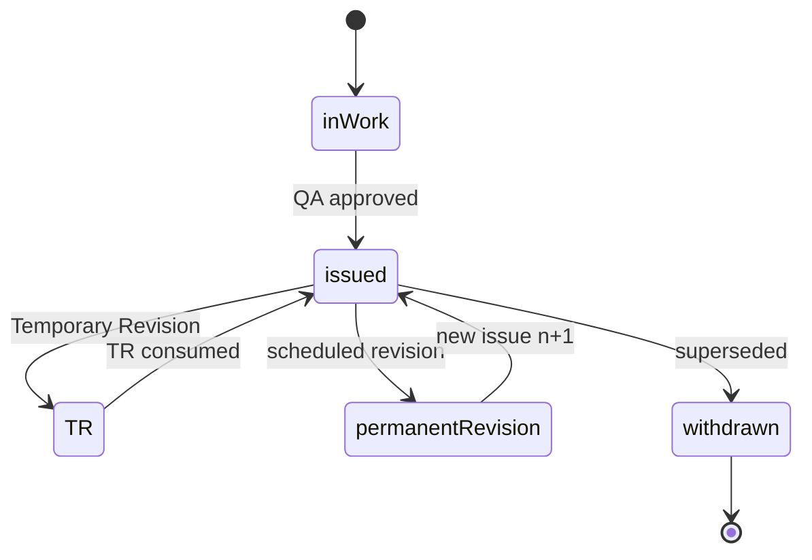

# ATLAS 000-009 · Section 00 · Subsection 030 · Subsubject 04 — Revision, Issue and Distribution Control

## 1. Purpose

Defines the **revision, issue and distribution-control** conventions under ATLAS `000-009.030` *documentación general*: temporary and permanent revisions, issue numbering, change-bar policy, recipient lists, acknowledgement tracking and withdrawal of superseded content. Required to satisfy ATA iSpec 2200 revision rules[^ata2200], S1000D issue/inWork tracking[^s1000d], AS9100D document control[^as9100d] and the Q+ATLANTIDE baseline[^baseline].

## 2. Scope

- Covers the *Revision, Issue and Distribution Control* subsubject (`04`) of subsection `030` *documentación general*.
- Inherits Q-Division authority and ORB support from the parent row in [`../../README.md` §3](../../README.md#3-architecture-table)[^archtable].
- Process classes in scope: **temporary revisions (TR)**, **permanent revisions**, **issue numbering**, **change-bar policy**, **distribution lists**, **acknowledgement tracking**, **withdrawal / supersession**.
- Enforces ATA iSpec 2200 revision rules[^ata2200], S1000D Issue 6.0 issue/inWork model[^s1000d] and AS9100D documented-information control[^as9100d].

## 3. Diagram

The diagram below shows the issue / inWork lifecycle of a Data Module and how Temporary and Permanent revisions transition it through distribution and supersession.

## 4. Footprint

| Metric | Value |
|---|---|
| Architecture | `ATLAS` — Aircraft Top-Level Architecture System |
| Master range | `000–099` |
| Code range | `000-009` |
| Section | `00` — Información General y Servicio |
| Subject | `00` — General Information |
| Subsection | `030` — documentación general |
| Subsubject | `04` — Revision, Issue and Distribution Control |
| Primary Q-Division | Q-DATAGOV[^qdiv] |
| Support Q-Divisions | Q-GROUND, Q-AIR |
| ORB support | ORB-PMO, ORB-LEG |
| Governance class | `baseline`[^gov] |
| Folder path | `Q+ATLANTIDE/000-099_ATLAS/000-009_Informacion-General-y-Servicio/030_documentacion-general/` |
| Document | `04_Revision-Issue-and-Distribution-Control.md` (this file) |
| Parent subsection | [`00_Overview.md`](./00_Overview.md) |
| Parent architecture | [`../../README.md`](../../README.md) |
| Parent baseline | [`organization/Q+ATLANTIDE.md`](../../../../organization/Q+ATLANTIDE.md) |

## 5. References & Citations

[^baseline]: **Q+ATLANTIDE controlled baseline (v1.0.0)** — [`organization/Q+ATLANTIDE.md`](../../../../organization/Q+ATLANTIDE.md). Defines the controlled `000-999` architecture-band taxonomy and the ATLAS-1000 register subpart.

[^archtable]: **ATLAS §3 Architecture Table** — [`../../README.md` §3](../../README.md#3-architecture-table). Authoritative source for the `000-009` row (Section `00` — Información General y Servicio, Primary Q-Division Q-DATAGOV).

[^qdiv]: **Q-Division authority** — Q-Divisions provide technical authority over an architecture row (Q+ATLANTIDE Note N-002). See [`organization/Q+ATLANTIDE.md` §4](../../../../organization/Q+ATLANTIDE.md#4-notes).

[^gov]: **Governance class** — Bands are classified as `baseline` or `restricted` per Q+ATLANTIDE §4 governance rules.

[^ata2200]: **ATA iSpec 2200 — Information Standards for Aviation Maintenance** — Industry standard for digital aircraft maintenance information; governs chapter / section / subject numbering inherited by ATLAS `000-099`.

[^ataspec100]: **ATA Spec 100 — Manufacturers' Technical Data** — Predecessor numbering scheme that established the 00–99 chapter map mirrored by ATLAS sub-ranges.

[^s1000d]: **S1000D Issue 6.0 — International specification for technical publications** — Common Source DataBase (CSDB) and Data Module Code (DMC) specification used across ATLAS technical publications.

[^as9100d]: **AS9100D — Quality Management Systems — Aviation, Space and Defense Organizations** — Quality-management baseline for all Q+ATLANTIDE deliverables.

### Applicable industry standards

The following ATA-family and industry standards apply to this subsubject in addition to the cross-cutting Q+ATLANTIDE governance:

- ATA iSpec 2200 — Information Standards for Aviation Maintenance[^ata2200]
- ATA Spec 100 — Manufacturers' Technical Data[^ataspec100]
- S1000D Issue 6.0 — International specification for technical publications[^s1000d]
- AS9100D — Quality Management Systems — Aviation, Space and Defense Organizations[^as9100d]
