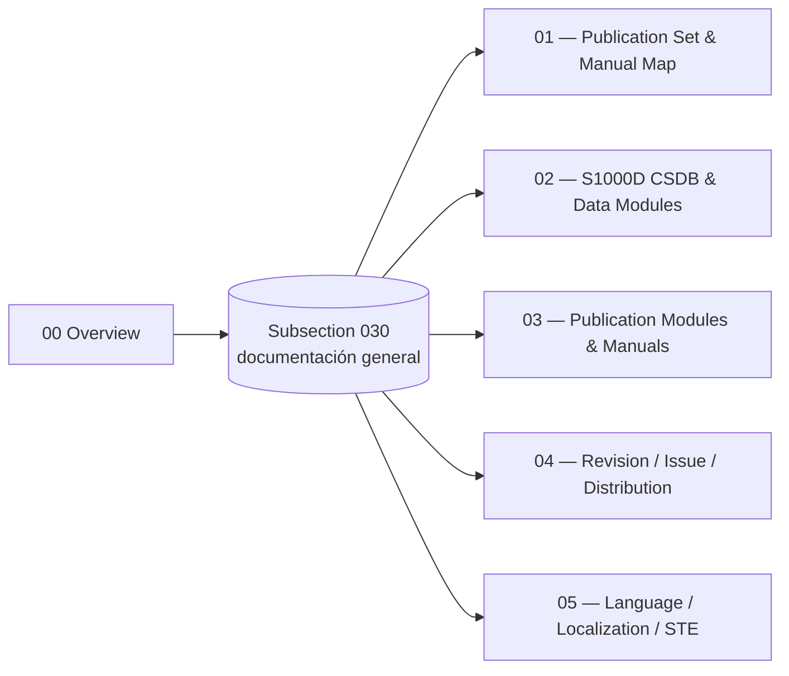

# ATLAS 000-009 · Section 00 · Subsection 030 — documentación general

## 1. Purpose

Subsection-level index for *documentación general* (`030`) within ATLAS `000-009` — *Información General y Servicio*. Aggregates the `00 Overview` and the detailed subsubjects (`01`–`05`) that extend it with the canonical publication set, S1000D CSDB structure, publication modules, revision control and language/STE rules, in conformance with the controlled Q+ATLANTIDE baseline[^baseline] and S1000D Issue 6.0[^s1000d].

## 2. Scope

- Covers the full subsubject namespace `00`–`99` of subsection `030` *documentación general*; subsubjects `01`–`05` are populated in this baseline release, the remaining `06`–`99` slots remain available for future extension per the Overview's authorisation[^archtable].
- Inherits Q-Division authority and ORB support from the parent row in [`../../README.md` §3](../../README.md#3-architecture-table)[^archtable].

## 3. Diagram

The diagram below shows how this subsection's `00 Overview` aggregates the populated subsubjects (`01`–`05`) into the *documentación general* slice of ATLAS `000-009`.

## 4. Subsubject Index

| NN | Title | Document | Status |
|---:|---|---|---|
| 00 | Overview | [`00_Overview.md`](./00_Overview.md) | active |
| 01 | Publication Set and Manual Map | [`01_Publication-Set-and-Manual-Map.md`](./01_Publication-Set-and-Manual-Map.md) | active |
| 02 | S1000D CSDB and Data Modules | [`02_S1000D-CSDB-and-Data-Modules.md`](./02_S1000D-CSDB-and-Data-Modules.md) | active |
| 03 | Publication Modules and Manuals | [`03_Publication-Modules-and-Manuals.md`](./03_Publication-Modules-and-Manuals.md) | active |
| 04 | Revision, Issue and Distribution Control | [`04_Revision-Issue-and-Distribution-Control.md`](./04_Revision-Issue-and-Distribution-Control.md) | active |
| 05 | Language, Localization and STE | [`05_Language-Localization-and-STE.md`](./05_Language-Localization-and-STE.md) | active |

## 5. Footprint

| Metric | Value |
|---|---|
| Architecture | `ATLAS` — Aircraft Top-Level Architecture System |
| Master range | `000–099` |
| Code range | `000-009` |
| Section | `00` — Información General y Servicio |
| Subject | `00` — General Information |
| Subsection | `030` — documentación general |
| Subsubject namespace | `00`–`99` (`00` + `01`–`05` populated) |
| Primary Q-Division | Q-DATAGOV[^qdiv] |
| Support Q-Divisions | Q-GROUND, Q-AIR |
| ORB support | ORB-PMO, ORB-LEG |
| Governance class | `baseline`[^gov] |
| Folder path | `Q+ATLANTIDE/000-099_ATLAS/000-009_Informacion-General-y-Servicio/030_documentacion-general/` |
| Document | `README.md` (this file) |
| Parent architecture | [`../../README.md`](../../README.md) |
| Parent baseline | [`organization/Q+ATLANTIDE.md`](../../../../organization/Q+ATLANTIDE.md) |

## Governance

Governed by [`organization/Q+ATLANTIDE.md`](../../../../organization/Q+ATLANTIDE.md)[^baseline]. All subsubjects under this subsection inherit `architecture_code = ATLAS`, `primary_q_division = Q-DATAGOV` and `governance_class = baseline` from the parent ATLAS band; extensions added under `06`–`99` shall preserve those header fields and reuse the footnote set declared below.

## 6. References & Citations

[^baseline]: **Q+ATLANTIDE controlled baseline (v1.0.0)** — [`organization/Q+ATLANTIDE.md`](../../../../organization/Q+ATLANTIDE.md). Defines the controlled `000-999` architecture-band taxonomy and the ATLAS-1000 register subpart.

[^archtable]: **ATLAS §3 Architecture Table** — [`../../README.md` §3](../../README.md#3-architecture-table). Authoritative source for the `000-009` row (Section `00` — Información General y Servicio, Primary Q-Division Q-DATAGOV).

[^qdiv]: **Q-Division authority** — Q-Divisions provide technical authority over an architecture row (Q+ATLANTIDE Note N-002). See [`organization/Q+ATLANTIDE.md` §4](../../../../organization/Q+ATLANTIDE.md#4-notes).

[^gov]: **Governance class** — Bands are classified as `baseline` or `restricted` per Q+ATLANTIDE §4 governance rules.

[^ata2200]: **ATA iSpec 2200 — Information Standards for Aviation Maintenance** — Industry standard for digital aircraft maintenance information; governs chapter / section / subject numbering inherited by ATLAS `000-099`.

[^ataspec100]: **ATA Spec 100 — Manufacturers' Technical Data** — Predecessor numbering scheme that established the 00–99 chapter map mirrored by ATLAS sub-ranges.

[^s1000d]: **S1000D Issue 6.0 — International specification for technical publications** — Common Source DataBase (CSDB) and Data Module Code (DMC) specification used across ATLAS technical publications.

[^as9100d]: **AS9100D — Quality Management Systems — Aviation, Space and Defense Organizations** — Quality-management baseline for all Q+ATLANTIDE deliverables.

### Applicable industry standards

The following ATA-family and industry standards apply to this subsection in addition to the cross-cutting Q+ATLANTIDE governance:

- ATA iSpec 2200 — Information Standards for Aviation Maintenance[^ata2200]
- ATA Spec 100 — Manufacturers' Technical Data[^ataspec100]
- S1000D Issue 6.0 — International specification for technical publications[^s1000d]
- AS9100D — Quality Management Systems — Aviation, Space and Defense Organizations[^as9100d]
