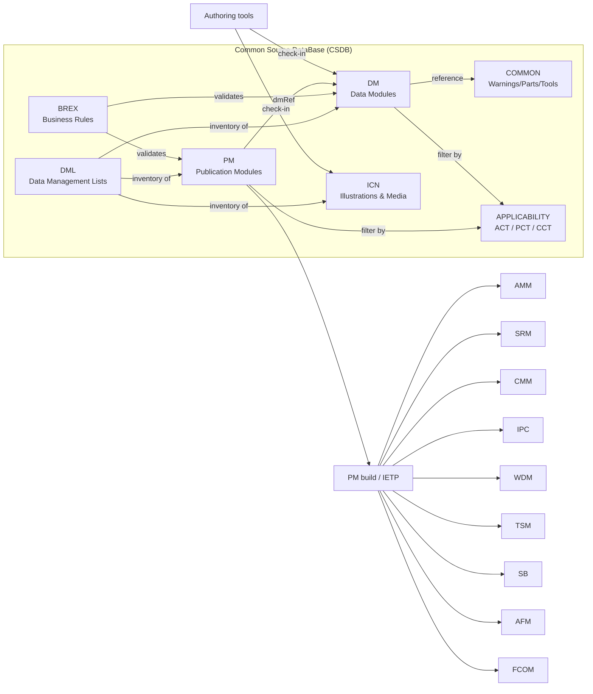
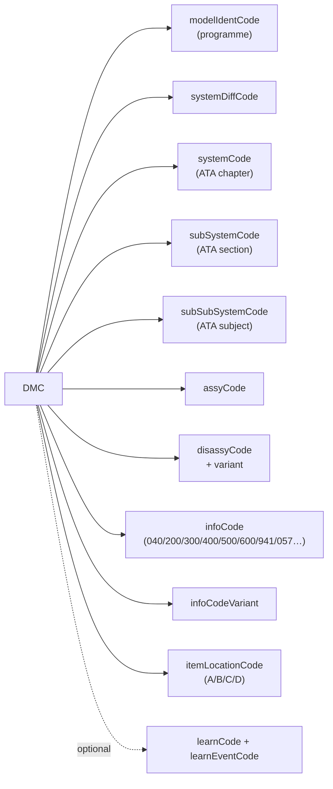
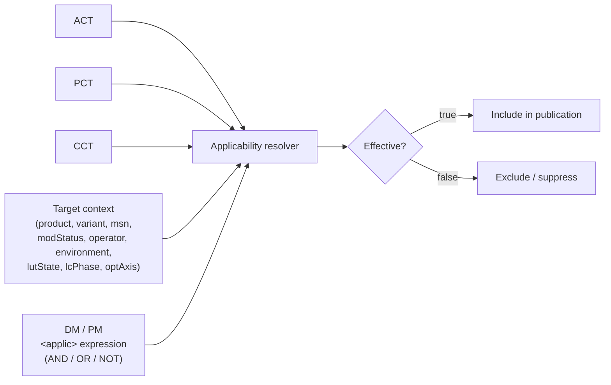
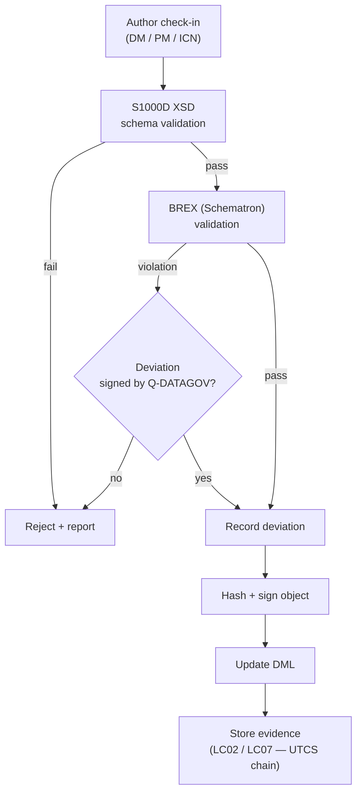
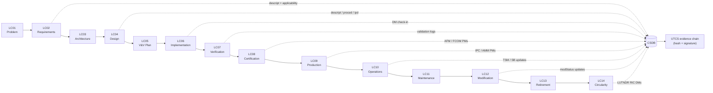

# Title: S1000D Technical Documentation Architecture

---

document_id: GAIA-QAO-DOC-REF-S1000D-ARCH

subtitle: "Technical Documentation Architecture — S1000D / CSDB / ICN / PM / BREX and ATA-Manual Mapping"

version: 1.0.0

status: "Draft → Stakeholder Review"

primary_language: English

owner: "Q-DATAGOV (technical authority) / Q-GROUND (operational publications)"

created: 2026-04-30

last_updated: 2026-04-30

next_review: 2026-10-30

classification: "Consortium Confidential – Approved Stakeholders Only"

baseline_dependencies:
  - "S1000D Issue 5.0 (or later, as adopted by Q-DATAGOV)"
  - "ATA iSpec 2200 (chapter taxonomy)"
  - "Q+ATLANTIDE1000 v1.0.0"
  - "UTCS v1.1"
  - "OPT-INS_FRAMEWORK CSDB canonical layout"

parent: "README.md — Annex D — Technical Documentation Architecture"

---

## Document Control

| Field | Value |
|---|---|
| **Document ID** | `GAIA-QAO-DOC-REF-S1000D-ARCH` |
| **Version** | `1.0.0` |
| **Status** | `Draft → Stakeholder Review` |
| **Primary Language** | English |
| **Owner** | `Q-DATAGOV / Q-GROUND` |
| **Created** | `2026-04-30` |
| **Last Updated** | `2026-04-30` |
| **Next Review** | `2026-10-30` |
| **Classification** | `Consortium Confidential – Approved Stakeholders Only` |
| **Parent Document** | [`README.md`](../../README.md) — Annex D |
| **Related** | [`docs/reference/Templates-Catalog-v2.4.md`](Templates-Catalog-v2.4.md), [`docs/reference/Glossary-Acronyms.md`](Glossary-Acronyms.md) |

---

## 1. Purpose & Scope

This document specifies the **technical documentation architecture** used across
the Q+ATLANTIDE1000 register and all programmes (commercial aviation, space,
defence, infrastructure). It is the canonical reference for:

- the **S1000D** information model (data modules, publication modules, BREX);
- the **Common Source DataBase (CSDB)** physical and logical layout;
- the **Illustration Control Number (ICN)** naming convention;
- **applicability** filtering across product variants, MSN, modification status,
  operator, environment, lifecycle phase and optimisation axis;
- the **mapping** between S1000D data modules and the legacy ATA-style manuals
  (AMM, SRM, CMM, IPC, WDM, TSM, SB, AFM, FCOM);
- integration with the lifecycle stages **LC01–LC14** and the UTCS evidence chain.

Out of scope: programme-specific authoring conventions (covered by each programme's
authoring guide) and proprietary CSDB tooling configurations.

---

## 2. Standards Baseline

| Standard | Use |
|---|---|
| **S1000D** (Issue 5.0 or later) | Information model for technical publications, CSDB, BREX, applicability, IETP. |
| **ATA iSpec 2200** | Chapter / section / subject numbering inherited by data module codes. |
| **ASD-STE100** (Simplified Technical English) | Authoring rules for procedural and descriptive content. |
| **DO-178C / DO-254 / ARP4754A / ARP4761** | Source of safety/assurance evidence referenced from data modules. |
| **ISO 27001** | Security controls for the CSDB and IETP delivery channels. |
| **EASA / FAA AMC** | Acceptable means of compliance for AFM, FCOM, AMM, MMEL content. |

S1000D is applied as the **single source of truth**; other manual formats (AMM, SRM,
etc.) are produced as **publication-time views** assembled from the CSDB.

---

## 3. Common Source DataBase (CSDB)

### 3.1 Logical model

The CSDB stores all reusable information objects and exposes them to authoring,
review, applicability filtering, and publication tooling. Every leaf-node in the
OPT-INS / Q+ATLANTIDE chapter tree owns a `PUB/AMM/CSDB/` directory with the
following canonical sub-folders:

| Folder | Contents | S1000D object |
|---|---|---|
| `DM/`  | Data modules — descriptive, procedural, fault, parts, wiring, schedule, training. | `<dmodule>` (DMC files) |
| `PM/`  | Publication modules — assemble DMs into a deliverable manual. | `<pm>` |
| `DML/` | Data Management Lists — inventories of CSDB objects by issue. | `<dml>` (`DMLC`, `DMLS`) |
| `BREX/`| Business Rules Exchange data modules — project-specific authoring rules. | `<dmodule>` of type `brDoc` |
| `ICN/` | Illustration Control Number assets (graphics, multimedia). | binary CGM/SVG/PNG/MP4 |
| `COMMON/` | Common information repository (warnings/cautions, parts, supplies, tools). | `<commonRepository>` |
| `APPLICABILITY/` | ACT, PCT, CCT and applicability expressions. | `<applicCrossRefTable>`, `<prodCrossRefTable>`, `<condCrossRefTable>` |

### 3.2 Physical layout (canonical)

```text
<chapter>/<leaf>/PUB/AMM/CSDB/
├── DM/                # data modules
├── PM/                # publication modules
├── DML/               # data management lists
├── BREX/              # project BREX
├── ICN/               # graphics & multimedia
├── COMMON/            # warnings, cautions, parts, tools, supplies
└── APPLICABILITY/     # ACT/PCT/CCT and applicability rules
```

This layout is reproduced for every leaf node in the OPT-INS_FRAMEWORK and
Q+ATLANTIDE registers; programme-specific CSDBs federate these per-leaf stores
into a single logical CSDB at publication time.

### 3.3 CSDB logical model (diagram)



### 3.4 Object identity & versioning

- Every CSDB object has a stable identifier (DMC, PMC, ICN).
- Every issue is **content-addressed** (hash) and signed; the signature and hash
  are recorded in the corresponding DML entry.
- Issues follow S1000D `issueNumber.inWork` semantics; the highest released
  issue with `inWork = "00"` is the published issue.

---

## 4. Data Modules

### 4.1 Data Module Code (DMC)

The DMC is the primary key of every data module and follows the S1000D structure:

```text
DMC-<modelIdentCode>-<systemDiffCode>-<systemCode>-<subSystemCode>-<subSubSystemCode>
    -<assyCode>-<disassyCode>-<disassyCodeVariant>-<infoCode>-<infoCodeVariant>-<itemLocationCode>[-<learnCode>-<learnEventCode>]
```

| Element | Source / convention |
|---|---|
| `modelIdentCode` | Programme code (e.g. `AMPEL360`, `BWBH2`, `DTTA200`). |
| `systemCode`, `subSystemCode`, `subSubSystemCode` | ATA iSpec 2200 chapter / section / subject (mirrors the OPT-INS leaf path). |
| `assyCode` / `disassyCode` | Assembly and disassembly variants for the procedure. |
| `infoCode` | Information type (descriptive `040`, operation `200`, servicing `300`, fault `400`, scheduled `500`, removal/installation `520`, repair `600`, IPD `941`, wiring `057`, etc.). |
| `infoCodeVariant` | Variant within the info type. |
| `itemLocationCode` | `A` (installed), `B` (on major assy), `C` (on bench), `D` (not applicable). |

#### 4.1.1 DMC anatomy (diagram)



### 4.2 Data module schemas in use

| Schema | Typical infoCode range | Use |
|---|---|---|
| `descript` | `0xx` | Descriptive content. |
| `proced`   | `2xx`, `3xx`, `5xx`, `6xx` | Operation, servicing, scheduled and repair procedures. |
| `fault`    | `4xx` | Fault isolation / TSM. |
| `ipd`      | `941`, `942` | Illustrated Parts Data. |
| `wrngdata` | — | Warnings, cautions, hazards. |
| `crew`     | — | Flight crew / FCOM content. |
| `schedul`  | `5xx` | Maintenance planning. |
| `brDoc`    | — | BREX rules (see §7). |
| `appliccrossreftable`, `prodcrossreftable`, `condcrossreftable` | — | Applicability cross-references. |
| `comrep`   | — | Common information repository. |

### 4.3 Authoring rules

- Procedural content is written in **ASD-STE100** Simplified Technical English.
- Reusable warnings, cautions, parts, tools and supplies are referenced from
  the **Common Information Repository**, never duplicated inline.
- Every safety statement (`<warning>`, `<caution>`) carries a `safetyRqmts`
  identifier traceable to the safety analysis (ARP4761).
- Every procedure references the applicable **applicability expression** (§6).
- DMs that derive from assurance evidence (DO-178C/DO-254) include a
  `<dmStatus>` attribute set referring to the SOI artefact identifier.

---

## 5. Publication Modules (PM)

A Publication Module assembles data modules into a deliverable manual. It is the
S1000D representation of an AMM, SRM, FCOM, etc.

### 5.1 Publication Module Code (PMC)

```text
PMC-<modelIdentCode>-<pmIssuer>-<pmNumber>-<pmVolume>
```

| Element | Convention |
|---|---|
| `modelIdentCode` | Same as DMC. |
| `pmIssuer`       | Issuing organisation (e.g. `00001` for Q-DATAGOV master). |
| `pmNumber`       | Numeric publication identifier (one per manual). |
| `pmVolume`       | Volume number when split. |

### 5.2 Standard publication set

Each programme produces, at minimum, the following PMs:

| PM | Content origin (info codes) | Mapped manual |
|---|---|---|
| AMM PM | `0xx`, `2xx`, `3xx`, `5xx`, `6xx` | Aircraft Maintenance Manual |
| SRM PM | `6xx` (repair) + ICN repair illustrations | Structural Repair Manual |
| CMM PM | `0xx`, `2xx`, `5xx`, `6xx` (component-scope) | Component Maintenance Manual |
| IPC PM | `941`, `942` | Illustrated Parts Catalogue |
| WDM PM | `057`, `058` | Wiring Diagram Manual |
| TSM PM | `4xx` | Trouble-Shooting Manual |
| SB PM  | `0xx` + temporary procedural DMs | Service Bulletin |
| AFM PM | `crew`, `0xx`, limitations DMs | Aeroplane Flight Manual (EASA/FAA approved) |
| FCOM PM | `crew`, normal/abnormal/emergency procedural DMs | Flight Crew Operating Manual |

### 5.3 PM build rules

- Each PM declares its **product cross-reference table (PCT)** so that
  applicability can be resolved at build time.
- PM content tables list **DMRefs**, not embedded content.
- Front matter (title page, list of effective DMs, change history) is generated
  from the DML.

---

## 6. Applicability Model

The applicability layer is the canonical mechanism to filter content by product,
variant, MSN, modification status, operator, environment, lifecycle state and
optimisation axis.

### 6.1 Tables

| Table | S1000D element | Purpose |
|---|---|---|
| **ACT** — Applicability Cross-reference Table | `<applicCrossRefTable>` | Declares applicability properties and assertions. |
| **PCT** — Product Cross-reference Table | `<prodCrossRefTable>` | Declares products, variants, MSN ranges. |
| **CCT** — Conditions Cross-reference Table | `<condCrossRefTable>` | Declares conditions (modification, operator, environment, lifecycle, optimisation axis). |

### 6.2 Canonical applicability properties

The CSDB-wide applicability vocabulary defines **nine** properties, all of which
use `applicPropertyIdent` matching the property name exactly:

| Property | Type | Examples |
|---|---|---|
| `product`     | prodattr | `AMPEL360e`, `BWBH2`, `DTTA200` |
| `variant`     | prodattr | `pax`, `cargo`, `tanker` |
| `msn`         | prodattr | `MSN-0001..MSN-0099` |
| `modStatus`   | condition | `pre-SB123`, `post-SB123` |
| `operator`    | condition | `OPER-XX`, `ANY` |
| `environment` | condition | `desert`, `arctic`, `maritime` |
| `lutState`    | condition | `USO`, `NPR`, `DIS`, `RIC` |
| `lcPhase`     | condition | `LC01`..`LC14` |
| `optAxis`     | condition | `safety`, `cost`, `emissions`, `mission` |

### 6.3 Expression logic

Applicability assertions support `AND`, `OR` and `NOT` and resolve to a Boolean
at filter time. PMs and IETP builders evaluate expressions against the **target
context** (a tuple of property values) to produce the effective publication.

Each `PUB/AMM/CSDB/APPLICABILITY/` directory carries an `APPLICABILITY.md`
specification that documents the local ACT/PCT/CCT, the nine attributes and
the EXPORT/IETP filtering policy.

### 6.4 Applicability resolution (diagram)



---

## 7. BREX (Business Rules Exchange)

The BREX data module encodes project-specific authoring and structural rules
that supplement the S1000D base schema.

### 7.1 Categories of rules

| Category | Examples |
|---|---|
| Naming / coding | DMC composition, PMC composition, ICN composition, allowed `infoCode` values per programme. |
| Structural | Mandatory `<dmStatus>` fields, minimum metadata, prohibited elements, required `<applic>` references. |
| Content | Use of STE, prohibited verbs/nouns, mandatory units (SI), tolerated tolerances. |
| Safety | Required safety statements per procedure class, required references to ARP4761 hazards. |
| Security / classification | Classification marks, redaction rules, export-control flags, restricted-band handling. |
| Applicability | Mandatory use of ACT/PCT/CCT for any conditional content. |

### 7.2 Validation flow

1. Authors save a DM/PM into the CSDB.
2. The CSDB validator runs **schema validation** (S1000D XSD) followed by
   **BREX validation**.
3. BREX violations block check-in unless an explicit deviation, signed by
   Q-DATAGOV, is recorded.
4. Validation results are stored as evidence in the LC02 / LC07 stage of the
   lifecycle (UTCS evidence chain).



### 7.3 BREX inheritance

A programme MAY chain BREX rules:

```text
S1000D base BREX
  → Q-DATAGOV master BREX (organisation-wide)
    → Programme BREX (e.g. AMPEL360)
      → Variant BREX (e.g. AMPEL360e cargo)
```


The most specific BREX prevails when rules conflict, except where the master
BREX marks a rule as `inheritable="false"` (non-overridable).

---

## 8. Illustration Control Number (ICN)

### 8.1 Format

```text
ICN-<modelIdentCode>-<senderIdent>-<seqNumber>-<responsiblePartnerCompany>-<originator>-<uniqueIdent>-<mediaType>
```

| Element | Convention |
|---|---|
| `modelIdentCode` | Programme code (matches DMC). |
| `senderIdent` | 5-character issuer code. |
| `seqNumber`   | Sequential number, zero-padded. |
| `responsiblePartnerCompany` | NCAGE or P&L.inc identifier. |
| `originator`  | NCAGE of the originator. |
| `uniqueIdent` | Unique within `(originator, modelIdentCode)`. |
| `mediaType`   | `001` raster, `002` vector, `003` 3D, `004` audio, `005` video. |

### 8.2 Asset rules

- Vector graphics (CGM/SVG) are preferred for technical illustrations.
- All ICN files carry **EXIF/metadata stripping** before publication.
- 3D ICNs (PLM-derived) link back to the source CAD revision in the digital
  thread; the link is recorded in the COMMON repository.
- Multimedia ICNs declare an alt-text and a transcript for accessibility.

### 8.3 Reuse and deduplication

ICN reuse across programmes is permitted; the CSDB de-duplicates by hash.
Re-issuing an ICN requires bumping `uniqueIdent` and superseding the previous
issue in the DML.

---

## 9. Manual Mapping (AMM / SRM / CMM / IPC / WDM / TSM / SB / AFM / FCOM)

The S1000D-first model means that no manual is authored directly; each manual
is a **publication-time view** of the CSDB.

| Manual | Primary info codes | Source DMs (typical schema) | Notes |
|---|---|---|---|
| **AMM** Aircraft Maintenance Manual | `040`, `2xx`, `3xx`, `5xx`, `6xx` | `descript`, `proced`, `schedul` | Mainline maintenance content; references TSM for fault isolation. |
| **SRM** Structural Repair Manual | `6xx` | `proced`, `descript`, ICN-heavy | Repair procedures, allowable damage, repair classification. |
| **CMM** Component Maintenance Manual | `0xx`, `2xx`, `5xx`, `6xx` | `descript`, `proced`, `schedul` | Component-scope; bench procedures (`itemLocationCode = C`). |
| **IPC** Illustrated Parts Catalogue | `941`, `942` | `ipd` | Drives provisioning and IPD-linked ICNs. |
| **WDM** Wiring Diagram Manual | `057`, `058` | `wrngdata` (wiring schemas), ICN | Auto-generated from harness/PLM data where possible. |
| **TSM** Trouble-Shooting Manual | `4xx` | `fault` | Fault codes traceable to BIT/health-monitoring sources. |
| **SB** Service Bulletin | `0xx` + temporary procedural DMs | `descript`, `proced` | Tied to a `modStatus` applicability flag. |
| **AFM** Aeroplane Flight Manual | limitations, performance, normal/abnormal/emergency | `crew`, `descript`, `proced` | EASA/FAA approved part of the type certificate. |
| **FCOM** Flight Crew Operating Manual | normal/abnormal/emergency, systems descriptions | `crew`, `descript`, `proced` | Operator-customisable; references AFM as the approved baseline. |

For each manual the corresponding PM file declares:

- the source DMs (via `<dmRef>`);
- the publication-time PCT;
- the BREX rules in effect;
- the front matter generator settings.

---

## 10. Lifecycle Integration (LC01–LC14)

The CSDB is the data backbone of the lifecycle gates. Each gate produces or
consumes specific S1000D artefacts:

| Gate | S1000D artefact | Role |
|---|---|---|
| **LC01** Problem Statement | `descript` DMs (concept) | Establishes the documentation scope. |
| **LC02** Requirements | `descript` + applicability seed | Requirements traceability anchors. |
| **LC03** Architecture | `descript` + ICNs | Architecture views. |
| **LC04** Design | `descript`, `proced`, `ipd` (provisional) | Engineering design content. |
| **LC05** V&V Plan | `proced` (test) + BREX update | Test procedures. |
| **LC06** Implementation | DM check-in, BREX validation | First validated baseline. |
| **LC07** Verification | Validation evidence in DML | BREX/Schematron run logs. |
| **LC08** Certification | AFM/FCOM PMs frozen | Approved publication set. |
| **LC09** Production | IPC/AMM PMs released | Provisioning + maintenance baseline. |
| **LC10** Operations | TSM/SB updates | In-service support. |
| **LC11** Maintenance | AMM/SRM/CMM in operational use | Continuous airworthiness. |
| **LC12** Modification | SBs + `modStatus` updates | Configuration evolution. |
| **LC13** Retirement | Decommissioning DMs | End-of-life procedures. |
| **LC14** Circularity | Disposal/recycling DMs | LUTNDR `RIC` integration. |



All check-ins are content-addressed; the resulting hash and signature feed the
UTCS evidence chain.

---

## 11. Governance & Roles

| Role | Owner | Responsibility |
|---|---|---|
| Technical authority for the CSDB | **Q-DATAGOV** | Schema, BREX, applicability vocabulary, security, signatures. |
| Operational publications | **Q-GROUND** | Authoring, review, release of AMM/SRM/CMM/IPC/WDM/TSM/SB. |
| Flight crew documentation | **Q-AIR** | AFM and FCOM authoring (with Q-DATAGOV technical authority). |
| Software/hardware assurance evidence linkage | **Q-HPC**, **Q-AIR** | Cross-reference DO-178C/DO-254 artefacts in DMs. |
| Compliance & legality | **ORB-LEG** | Export-control marking, classification, regulatory traceability. |
| Audit | **Auditorial / Control branch** | Periodic BREX, applicability and signature audits. |

---

## 12. Tooling & Validation

The CSDB tool-chain MUST provide:

1. S1000D **XSD** schema validation on every check-in.
2. **BREX (Schematron)** validation, with the inheritance chain in §7.3.
3. **Applicability resolution** for any target context.
4. **DML generation** (DMLC, DMLS) on every release.
5. **PM build** producing IETP and print-ready output.
6. **Hashing and signing** of every issued object; signature stored in the DML.
7. **Export filtering** that honours `APPLICABILITY.md` rules and the
   classification/export-control markings on each DM and ICN.

CI pipelines run schema + BREX validation on every commit touching the CSDB
folders and publish the results as part of the LC07 evidence package.

---

## 13. References

- S1000D Issue 5.0 — *International specification for technical publications*.
- ATA iSpec 2200 — *Information Standards for Aviation Maintenance*.
- ASD-STE100 — *Simplified Technical English*.
- README.md — Annex D (this document's parent reference).
- `docs/reference/Templates-Catalog-v2.4.md` — master template reference.
- `docs/reference/Glossary-Acronyms.md` — terms and acronyms.
- `OPT-INS_FRAMEWORK/` — canonical CSDB folder layout per leaf node.
- `APPLICABILITY.md` files under each `PUB/AMM/CSDB/APPLICABILITY/` directory —
  local applicability instantiations.

---

*— End of `docs/reference/S1000D-Architecture.md` —*
