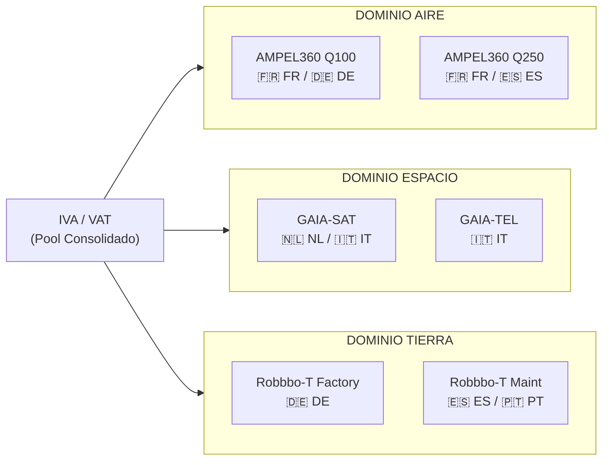
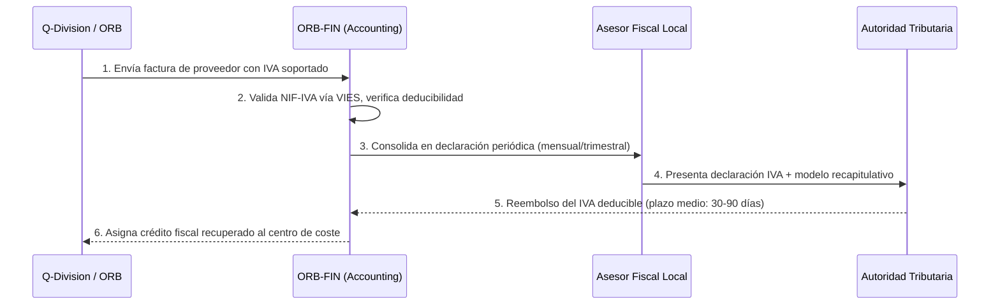
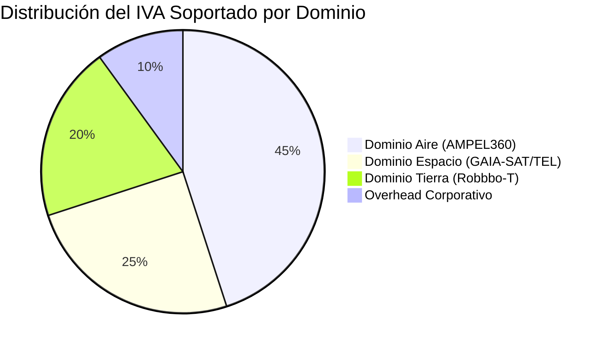

# 💶 `ORB-FIN-08-VAT-DISTRIBUTION.md`
## VAT Distribution Model — GQAOA Consortium

**Document ID:** ORB-FIN-08-VAT-DISTRIBUTION
**Unidad Responsable:** ORB-FIN (Finanzas y Presupuesto)
**Parent Document:** [`ORB-FIN-01-BUDGET-MASTER.xlsx`](./ORB-FIN-01-BUDGET-MASTER.xlsx)
**Foco:** Distribución, Asignación y Recuperación del IVA (VAT) en el Consorcio Multinacional
**Estado:** α (operacional_stable)
**Normativa Base:** EU VAT Directive 2006/112/EC, Council Implementing Regulation (EU) No 282/2011

---

### **1. Propósito**

Este documento define el modelo de distribución del Impuesto sobre el Valor Añadido (IVA / VAT) aplicable a las operaciones del consorcio **GAIA QUANTUM AMPEL OPT-INS ARCHITECTURE, INC. (GQAOA, INC.)**. Dado que el consorcio opera como una entidad público-privada con socios industriales y académicos distribuidos en múltiples Estados Miembro de la Unión Europea, la correcta distribución, facturación y recuperación del IVA es un requisito crítico de cumplimiento fiscal.

---

### **2. Alcance**

El modelo cubre:

* Entregas intracomunitarias de bienes y servicios entre socios del consorcio.
* Facturación a entidades externas (clientes finales, proveedores Tier 1/2/3).
* Distribución del IVA entre Q-Divisions y programas (AMPEL360, GAIA-SPACE, Robbbo-T).
* Procedimientos de recuperación de IVA soportado.
* Obligaciones de reporte por Estado Miembro (declaraciones recapitulativas, modelo 349 equivalentes).

---

### **3. Tipos Impositivos por Estado Miembro**

La siguiente tabla refleja los tipos estándar de IVA aplicables en los principales países del consorcio. Los tipos reducidos y superreducidos se aplican según la naturaleza de la transacción (e.g., I+D, equipos aeronáuticos, servicios de formación).

| Estado Miembro | Tipo Estándar (%) | Tipo Reducido (%) | Observaciones |
| :------------- | :-----------: | :-----------: | :------------ |
| 🇫🇷 Francia | 20,0 | 5,5 / 10,0 | Sede central de ingeniería BWB |
| 🇩🇪 Alemania | 19,0 | 7,0 | Q-STRUCTURES, Q-HPC, Q-INDUSTRY |
| 🇪🇸 España | 21,0 | 10,0 / 4,0 | Q-AIR, Q-GREENTECH, ORB-FIN |
| 🇮🇹 Italia | 22,0 | 5,0 / 10,0 | Q-SCIRES, centros de investigación cuántica |
| 🇳🇱 Países Bajos | 21,0 | 9,0 | Q-SPACE, centros de comunicaciones |
| 🇧🇪 Bélgica | 21,0 | 6,0 / 12,0 | Sede administrativa del consorcio |
| 🇵🇹 Portugal | 23,0 | 6,0 / 13,0 | Q-GROUND, soporte logístico |
| 🇸🇪 Suecia | 25,0 | 6,0 / 12,0 | Q-ENERGY, energías renovables |

> **Nota:** Los tipos se actualizan conforme a la legislación vigente de cada Estado Miembro. La tabla anterior es indicativa y debe revisarse trimestralmente por ORB-FIN / Accounting.

---

### **4. Modelo de Distribución del IVA**

#### **4.1 Principio General: País de Destino**

El consorcio GQAOA aplica el **principio de destino** conforme al artículo 44 de la Directiva 2006/112/CE: los servicios prestados entre entidades sujetas pasivas se gravan en el Estado Miembro donde está establecido el destinatario.

#### **4.2 Entregas Intracomunitarias de Bienes**

Para las entregas de componentes, prototipos, módulos y materias primas entre socios del consorcio ubicados en diferentes Estados Miembro:

* **Exención aplicable:** Artículo 138 de la Directiva 2006/112/CE.
* **Requisito:** Ambas partes deben disponer de un número de identificación a efectos del IVA válido en el sistema VIES.
* **Documentación:** Conocimiento de embarque / CMR + factura con referencia "Entrega intracomunitaria exenta, Art. 138 Dir. 2006/112/CE".

#### **4.3 Prestaciones de Servicios Intracomunitarias (B2B)**

Los servicios entre socios del consorcio (ingeniería, consultoría, formación, I+D, licencias de software, acceso a infraestructura cuántica) siguen la regla general B2B:

* **Localización:** En el Estado Miembro del destinatario (Art. 44).
* **Inversión del Sujeto Pasivo (Reverse Charge):** El destinatario del servicio autoliquida el IVA en su declaración local.
* **Facturación:** Sin IVA, con referencia "Inversión del sujeto pasivo, Art. 196 Dir. 2006/112/CE".

---

### **5. Distribución por Q-Division y Programa**

La asignación del IVA soportado y repercutido se imputa a cada Q-Division y programa conforme a la siguiente matriz:

#### **5.1 Tabla de Imputación por División**

| Q-Division / ORB-Function | País Principal | NIF-IVA (Formato) | % del IVA Soportado Total | Programa(s) Asociado(s) |
| :------------------------ | :------------- | :----------------- | :-----------------------: | :---------------------- |
| Q-STRUCTURES | 🇩🇪 Alemania | DE + 9 dígitos | 18% | AMPEL360 Q100, Q250 |
| Q-AIR | 🇪🇸 España | ES + letra + 7 dígitos + letra | 12% | AMPEL360 Q100, Q250, C-MAX |
| Q-ENERGY | 🇸🇪 Suecia | SE + 12 dígitos | 8% | AMPEL360 Q100 |
| Q-INDUSTRY | 🇩🇪 Alemania | DE + 9 dígitos | 15% | Robbbo-T Factory |
| Q-HPC | 🇩🇪 Alemania | DE + 9 dígitos | 10% | Transversal |
| Q-GREENTECH | 🇪🇸 España | ES + letra + 7 dígitos + letra | 5% | AMPEL360 XWLRGA |
| Q-GROUND | 🇵🇹 Portugal | PT + 9 dígitos | 4% | Robbbo-T Maint |
| Q-SPACE | 🇳🇱 Países Bajos | NL + 12 dígitos | 12% | GAIA-SAT, GAIA-TEL |
| Q-SCIRES | 🇮🇹 Italia | IT + 11 dígitos | 6% | Transversal (I+D) |
| ORB-FIN / Admin | 🇧🇪 Bélgica | BE + 10 dígitos | 10% | Overhead corporativo |
| **TOTAL** | | | **100%** | |

---

### **6. Procedimiento de Recuperación del IVA Soportado**

#### **6.1 Plazos de Declaración**

| Estado Miembro | Periodicidad | Plazo de Presentación | Modelo Recapitulativo |
| :------------- | :----------- | :-------------------- | :-------------------- |
| Francia | Mensual | 19 del mes siguiente | CA3 |
| Alemania | Mensual | 10 del mes siguiente | UStVA |
| España | Trimestral | 20 del mes siguiente al trimestre | Modelo 303 + 349 |
| Italia | Mensual/Trimestral | 16 del mes siguiente | Lipe + Esterometro |
| Países Bajos | Trimestral | Último día del mes siguiente | OB |
| Bélgica | Mensual | 20 del mes siguiente | Listing 325 |
| Portugal | Mensual | 10 del segundo mes siguiente | Declaração Periódica |
| Suecia | Mensual | 26 del mes siguiente | Skattedeklaration |

#### **6.2 Recuperación Transfronteriza (Directiva 2008/9/CE)**

Cuando una Q-Division soporta IVA en un Estado Miembro donde no está establecida, la recuperación se tramita mediante el procedimiento electrónico de la Directiva 2008/9/CE:

1. Solicitud electrónica ante la Autoridad Tributaria del Estado Miembro de establecimiento.
2. Plazo: antes del 30 de septiembre del año siguiente al periodo de devolución.
3. Importe mínimo anual: €50 (o equivalente trimestral de €400).
4. ORB-FIN / Accounting consolida y tramita todas las solicitudes centralizadamente.

---

### **7. Régimen Especial: I+D y Defensa**

#### **7.1 Exenciones en I+D**

Determinadas actividades de investigación y desarrollo pueden beneficiarse de tipos reducidos o exenciones parciales según la legislación nacional:

* **Francia:** Crédito Fiscal por Investigación (CIR) — reducción indirecta de la carga fiscal global.
* **España:** Deducciones por I+D+i (Art. 35 Ley 27/2014 del Impuesto sobre Sociedades) — no aplica directamente al IVA pero reduce carga tributaria.
* **Italia:** Credito d'imposta per ricerca e sviluppo.

#### **7.2 Operaciones con Componente de Defensa**

Para los programas con aplicación dual (civil-militar), como componentes del DTTA 200-299:

* Exención potencial bajo Art. 151 Dir. 2006/112/CE para suministros a fuerzas armadas de otro Estado Miembro.
* Requiere certificado de exención emitido por el Estado Miembro de destino.

---

### **8. Facturación y Documentación**

#### **8.1 Requisitos de Factura (Art. 226 Dir. 2006/112/CE)**

Toda factura emitida entre entidades del consorcio debe incluir:

| Campo | Descripción | Ejemplo |
| :---- | :---------- | :------ |
| Fecha de emisión | Fecha de la factura | 2026-04-08 |
| Número secuencial | Identificador único | GQAOA-FIN-2026-001234 |
| NIF-IVA del emisor | Número de identificación del proveedor | DE123456789 |
| NIF-IVA del destinatario | Número de identificación del cliente | ES-X1234567A |
| Descripción del servicio/bien | Detalle suficiente para identificar la transacción | "Ingeniería estructural — AMPEL360 Q100 — WP 3.2" |
| Base imponible | Importe antes de IVA | €125.000,00 |
| Tipo de IVA | % aplicable o referencia a exención | "Exenta — Art. 138 Dir. 2006/112/CE" |
| Importe del IVA | Cuota de IVA o €0 si exenta | €0,00 |
| Importe total | Base + IVA | €125.000,00 |
| Referencia de programa | Código del programa GQAOA | AMPEL360BWB-Q100 |
| Centro de coste | Q-Division + WP | Q-STRUCTURES / WP-3.2 |

#### **8.2 Archivo y Retención**

* **Plazo de conservación:** Mínimo 10 años (conforme a legislación más restrictiva del consorcio).
* **Formato:** PDF/A-3 con datos estructurados XML embebidos (ZUGFeRD / Factur-X para interoperabilidad).
* **Repositorio:** Integrado en el sistema PLM GAIA-Nexus y referenciado en [`ORB-FIN-06-SUPPLIER-PAYMENTS.db`](./ORB-FIN-06-SUPPLIER-PAYMENTS.db).

---

### **9. Consolidación y Reporting**

#### **9.1 Dashboard de IVA**

ORB-FIN mantiene un panel de control dedicado al seguimiento del IVA:

#### **9.2 KPIs de Gestión del IVA**

| KPI | Descripción | Objetivo | Frecuencia |
| :-- | :---------- | :------- | :--------- |
| Tasa de recuperación IVA | % del IVA soportado recuperado | ≥ 95% | Trimestral |
| Plazo medio de reembolso | Días desde solicitud hasta cobro | ≤ 60 días | Trimestral |
| Errores en facturación IVA | Nº de facturas con errores de IVA | < 1% | Mensual |
| Cumplimiento de plazos | % de declaraciones presentadas a tiempo | 100% | Mensual |
| Coste de gestión fiscal | Coste del compliance como % del IVA gestionado | ≤ 0,5% | Anual |

---

### **10. Gobernanza y Responsabilidades**

| Rol | Responsable | Funciones |
| :-- | :---------- | :-------- |
| **CFO** | Chief Financial Officer | Aprobación de la política fiscal del consorcio |
| **Head of Accounting** | ORB-FIN / Accounting | Consolidación de declaraciones, reconciliación IVA |
| **Tax Compliance Manager** | ORB-FIN / FP&A | Coordinación con asesores fiscales locales, VIES |
| **Q-Division Finance Lead** | Cada Q-Division | Validación de facturas de proveedores, imputación a WPs |
| **External Tax Advisor** | Firma externa (Big 4) | Asesoramiento especializado, auditoría fiscal |

---

### **11. Interacción con Otros Documentos ORB-FIN**

| Documento | Relación con VAT Distribution |
| :-------- | :---------------------------- |
| [`ORB-FIN-01-BUDGET-MASTER.xlsx`](./ORB-FIN-01-BUDGET-MASTER.xlsx) | Los presupuestos incluyen partidas de IVA no deducible como coste |
| [`ORB-FIN-02-CAPEX-TRACKER.dashboard`](./ORB-FIN-02-CAPEX-TRACKER.dashboard) | El CAPEX se registra neto de IVA deducible |
| [`ORB-FIN-03-OPEX-REPORT.dashboard`](./ORB-FIN-03-OPEX-REPORT.dashboard) | El OPEX incluye IVA no recuperable como gasto operativo |
| [`ORB-FIN-05-RISK-ASSESSMENT.xlsx`](./ORB-FIN-05-RISK-ASSESSMENT.xlsx) | Riesgos de cambios legislativos en tipos de IVA |
| [`ORB-FIN-06-SUPPLIER-PAYMENTS.db`](./ORB-FIN-06-SUPPLIER-PAYMENTS.db) | Registro del IVA soportado por transacción |

---

### **12. Revisión y Actualización**

* **Revisión ordinaria:** Trimestral, alineada con `ORB-FIN-07-QUARTERLY-REVIEW.pptx`.
* **Revisión extraordinaria:** Ante cambios legislativos en tipos de IVA o reglas de localización en cualquier Estado Miembro.
* **Aprobación:** CFO + Head of Accounting.

---

**[FIN DEL DOCUMENTO]**
