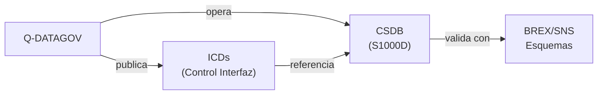

# Q-DATAGOV — Gobierno del Dato, Normas, Documentación y CSDB
> *El sistema nervioso documental del programa: datos, estándares y trazabilidad desde el concepto hasta el retiro.*

**Identificador:** GQAOA-ORG-QDIV-Q-DATAGOV-001
**Versión:** 1.0.0 · **Fecha:** 25 de abril de 2026 · **Estado:** α

---

## 1. Misión y Alcance

Q-DATAGOV es la división técnica responsable del gobierno del dato, la gestión documental, la arquitectura de información y el Common Source DataBase (CSDB) del programa GQAOA. Su alcance cubre la definición y mantenimiento de estándares de documentación (S1000D, ASD-STE100, iSpec 2200), la gestión del ciclo de vida de datos técnicos, la arquitectura de los Data Modules (DMs), y el esquema BREX/SNS del programa.

Q-DATAGOV actúa como la fuente única de verdad (SSOT) para toda la documentación técnica del programa, garantizando la trazabilidad, la coherencia semántica y la interoperabilidad de los datos entre todas las Q-Divisions y con los sistemas de los operadores y autoridades reguladoras.

---

## 2. Responsabilidades Clave

- **CSDB y S1000D:** Operación y mantenimiento del Common Source DataBase, incluyendo esquemas XML, BREX, SNS, ICNs y Data Module Lists (DML).
- **Estándares de documentación:** Definición y custodia de los estándares de autoría técnica del programa (S1000D, ASD-STE100 Simplified Technical English, DITA).
- **Gestión del ciclo de vida de datos:** Implementación del SSOT (Single Source of Truth) con control de versiones, configuración y trazabilidad de todos los artefactos técnicos.
- **Interface Control Documents (ICDs):** Coordinación de la publicación y control de cambios de los ICDs entre subsistemas y Q-Divisions.
- **LUTNDR — Registro de Tecnologías:** Mantenimiento del LUT_REGISTER.yaml y LUT_CIRCULARITY.yaml conforme a la especificación LUTNDR.
- **Arquitectura de información:** Diseño del esquema de metadatos, aplicabilidades (ACT/PCT/CCT) y modelo de datos del programa.
- **Gestión de configuración (CM):** Coordinación del Configuration Status Accounting (CSA) y del Configuration Management Plan (CMP).
- **Interoperabilidad con sistemas externos:** Publicación de datos en formatos IETP, exportación hacia sistemas de los operadores y autoridades de certificación.

---

## 3. Entregables Clave

| ID | Descripción | Tipo | Estado |
|----|-------------|------|--------|
| Q-DATAGOV-01-CSDB-SCHEMA.xml | Esquema XML maestro del CSDB GQAOA (S1000D Iss. 5.0) | XML | α |
| Q-DATAGOV-02-BREX-MASTER.xml | Business Rules Exchange Object maestro del programa | XML | α |
| Q-DATAGOV-03-SNS-CATALOG.xml | Standard Numbering System — catálogo completo del programa | XML | α |
| Q-DATAGOV-04-DML-MASTER.xml | Data Module List maestra (todas las Q-Divisions) | XML | α |
| Q-DATAGOV-05-DATA-GOV-PLAN.md | Plan de Gobierno del Dato — políticas, roles y procesos | MD | α |
| Q-DATAGOV-06-CM-PLAN.md | Plan de Gestión de Configuración (CMP) del programa | MD | α |
| Q-DATAGOV-07-APPLICABILITY-MODEL.md | Modelo de aplicabilidad S1000D (ACT/PCT/CCT — 9 atributos) | MD | α |

---

## 4. RACI de Dominio

| Actividad | Q-DATAGOV Lead | Co-Q-Divisions (C) | ORB Support (C/I) |
|-----------|---------------|-------------------|-------------------|
| Operación y mantenimiento CSDB | **A**/R | Todas las Q-Divisions (C) | ORB-IT (R) |
| Definición estándares S1000D / BREX | **A**/R | Q-SCIRES (C), Q-GROUND (C) | ORB-LEG (I) |
| Gestión de configuración (CMP) | **A**/R | ORB-PMO (R), Q-SCIRES (C) | ORB-PMO (R) |
| ICDs — publicación y control de cambios | **A**/R | Todas las Q-Divisions (R) | ORB-PMO (I) |
| LUTNDR — registro de tecnologías | **A**/R | Q-GREENTECH (C), Q-SCIRES (C) | ORB-CSR (I) |
| Modelo de aplicabilidad ACT/PCT/CCT | **A**/R | Q-SCIRES (C), Q-HPC (C) | ORB-LEG (I) |
| Publicaciones técnicas (AMM, SRM, IPC) | **A**/R | Q-STRUCTURES (R), Q-GROUND (R) | ORB-PMO (I) |
| Exportación IETP para operadores | **A**/R | Q-GROUND (C), Q-HPC (C) | ORB-MKTG (I) |

---

## 5. Interfaces Clave

### Con otras Q-Divisions

| Q-Division | Qué se intercambia | Dirección |
|------------|-------------------|-----------|
| Todas (10) | Entrega de DMs, ICDs y datos técnicos en el CSDB | Todas → Q-DATAGOV |
| Q-HPC | Datasets de simulación; metadatos de modelos IA/cuánticos | Bidireccional |
| Q-GROUND | Contenido de AMM/SRM/IPC para publicación | Q-GROUND → Q-DATAGOV |
| Q-SCIRES | Datos de ensayo y certificación para inclusión en CSDB | Q-SCIRES → Q-DATAGOV |
| Q-GREENTECH | LUT_REGISTER.yaml y LUT_CIRCULARITY.yaml | Q-GREENTECH → Q-DATAGOV |
| Q-SPACE | ICDs de comunicaciones satélite y enlace de datos | Q-SPACE → Q-DATAGOV |

### Con unidades ORB

| ORB Unit | Naturaleza de la interacción |
|----------|------------------------------|
| ORB-IT | Infraestructura del CSDB (servidores, backups, acceso), seguridad de datos |
| ORB-LEG | Cumplimiento S1000D, iSpec 2200, GDPR para datos de operadores |
| ORB-PMO | Integración del CMP con el cronograma maestro del programa |
| ORB-HR | Formación en herramientas de autoría S1000D y CSDB para todo el personal técnico |

---

## 6. KPIs del Dominio

| KPI | Objetivo | Fuente |
|-----|----------|--------|
| Cobertura de DMs en CSDB (vs. DML maestra) | ≥ 98% | Q-DATAGOV-04-DML-MASTER |
| Tasa de validación BREX (DMs válidos) | ≥ 99.5% | CSDB/s1000d_validator.py |
| Tiempo medio de publicación de un DM (autoría → CSDB) | ≤ 5 días hábiles | Q-DATAGOV-05-DATA-GOV-PLAN |
| Trazabilidad de requisitos a DMs (bidireccional) | 100% | Q-DATAGOV-06-CM-PLAN |
| Integridad del LUT_REGISTER.yaml (tecnologías registradas) | 100% cobertura de tecnologías activas | LUTNDR spec |

---

## 7. Riesgos Específicos

| Riesgo | Impacto | Probabilidad | Mitigación |
|--------|---------|--------------|------------|
| Fragmentación de datos por herramientas propietarias no integradas | Alto | Media | Mandato de uso de CSDB/S1000D para todos los artefactos; auditorías trimestrales |
| Pérdida de trazabilidad requisito-entregable en cambios de configuración | Alto | Media | Control de cambios integrado en CSDB; proceso ECO obligatorio |
| Violación de GDPR en exportación de datos de operadores | Crítico | Baja | Cláusulas contractuales con ORB-LEG; anonimización de datos sensibles |
| Deuda técnica en el esquema BREX ante evolución del estándar S1000D | Medio | Media | Suscripción activa al ASD S1000D Steering Committee; revisión anual del BREX |

---

## 8. Referencias

- [Matriz RACI Maestra Q-Divisions](../Readme.md)
- [Documento Organizacional Maestro GQAOA](../../README.md)
- [AMPEL360-BWB-Q100 Docs](../../../programs/AMPEL360/AMPEL360-BWB-Q100/Docs/readme.md)
- [CSDB S1000D Validator](../../../CSDB/s1000d_validator.py)
- [LUTNDR — Registro de Tecnologías](../../../OPT-INS_FRAMEWORK/GQAOA-UTA-LUTNDR-001.md)
- [CSDB APPLICABILITY Model](../../../CSDB/readme.md)

---

**[FIN DEL DOCUMENTO]**
