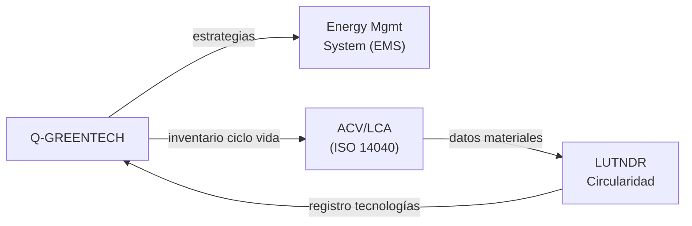

# Q-GREENTECH — Sistemas de Energía, Baterías y Sostenibilidad
> *La división que alimenta el futuro: energía limpia, almacenamiento avanzado y responsabilidad con el planeta.*

**Identificador:** GQAOA-ORG-QDIV-Q-GREENTECH-001
**Versión:** 1.0.0 · **Fecha:** 25 de abril de 2026 · **Estado:** α

---

## 1. Misión y Alcance

Q-GREENTECH es la división técnica responsable del diseño, desarrollo e integración de todos los sistemas de propulsión sostenible, almacenamiento de energía y tecnologías de economía circular del programa GQAOA. Su alcance cubre sistemas de propulsión híbrida-eléctrica, celdas de combustible de hidrógeno, baterías de alta densidad energética, gestión térmica, y el Análisis de Ciclo de Vida (ACV/LCA) de la aeronave completa.

Q-GREENTECH lidera además la estrategia de sostenibilidad del consorcio, actuando como división propietaria de los compromisos ESG técnicos y coordinando con ORB-CSR y ORB-LEG para el cumplimiento de la normativa ambiental (ISO 14040, CORSIA, EU ETS).

---

## 2. Responsabilidades Clave

- **Sistemas de propulsión híbrida-eléctrica:** Diseño e integración de motores eléctricos de alta potencia, inversores y gestión de la cadena eléctrica de propulsión.
- **Almacenamiento de energía (baterías/H₂):** Especificación, cualificación y monitorización de packs de baterías de estado sólido y sistemas de almacenamiento criogénico de H₂.
- **Gestión de energía a bordo (EMS):** Desarrollo del Energy Management System, incluyendo estrategias de carga/descarga óptima y recuperación regenerativa.
- **Análisis de Ciclo de Vida (ACV/LCA):** Ejecución del ACV desde extracción de materiales hasta reciclaje, conforme a ISO 14040/14044.
- **Huella de carbono y neutralidad climática:** Modelado de emisiones Scope 1, 2 y 3; roadmap hacia cero emisiones netas en operaciones terrestres para 2030.
- **Tecnologías de hidrógeno:** Seguimiento del TRL de almacenamiento criogénico, infraestructura de avituallamiento H₂ y seguridad de sistemas H₂ a bordo.
- **Economía circular (LUTNDR):** Coordinación del registro de tecnologías en uso/retiro/nueva proyección (LUT_REGISTER.yaml) y del plan de circularidad de materiales.
- **Certificación ambiental:** Liderazgo del proceso de certificación ESG/ISO 14040 y reporting ante ORB-CSR.

---

## 3. Entregables Clave

| ID | Descripción | Tipo | Estado |
|----|-------------|------|--------|
| Q-GREENTECH-01-ENERGY-SYS-SPEC.md | Especificación del sistema de energía híbrida-eléctrica (HEP) | MD | α |
| Q-GREENTECH-02-BATTERY-SPEC.xlsx | Especificación técnica de pack de baterías de estado sólido | XLSX | α |
| Q-GREENTECH-03-LCA-REPORT.pdf | Análisis de Ciclo de Vida completo aeronave AMPEL360-BWB-Q100 | PDF | β |
| Q-GREENTECH-04-H2-STORAGE-SPEC.md | Especificación de almacenamiento criogénico de hidrógeno | MD | β |
| Q-GREENTECH-05-EMS-ARCHITECTURE.md | Arquitectura del sistema de gestión de energía (EMS) | MD | β |
| Q-GREENTECH-06-ESG-CERT-MATRIX.xlsx | Matriz de certificación ESG / ISO 14040 | XLSX | β |
| Q-GREENTECH-07-CARBON-ROADMAP.md | Hoja de ruta de neutralidad de carbono 2025–2030 | MD | α |

---

## 4. RACI de Dominio

| Actividad | Q-GREENTECH Lead | Co-Q-Divisions (C) | ORB Support (C/I) |
|-----------|-----------------|-------------------|-------------------|
| Diseño sistema propulsión híbrida | **A**/R | Q-MECHANICS (R), Q-SCIRES (C) | ORB-PMO (I) |
| Especificación baterías estado sólido | **A**/R | Q-STRUCTURES (C), Q-SCIRES (C) | ORB-PROC (C) |
| ACV/LCA aeronave completa | **A**/R | Q-SCIRES (R), Q-DATAGOV (C) | ORB-CSR (C) |
| Sistema de gestión de energía (EMS) | **A**/R | Q-HPC (R), Q-MECHANICS (C) | ORB-IT (C) |
| Almacenamiento H₂ criogénico | **A**/R | Q-STRUCTURES (C), Q-SCIRES (R) | ORB-LEG (C) |
| Certificación ESG/ISO 14040 | **A**/R | Q-SCIRES (R), Q-DATAGOV (C) | ORB-CSR (C), ORB-LEG (C) |
| Economía circular (LUTNDR) | **A**/R | Q-STRUCTURES (C), Q-INDUSTRY (R) | ORB-CSR (C) |
| Gestión térmica sistemas eléctricos | **A**/R | Q-MECHANICS (R), Q-AIR (C) | ORB-PMO (I) |

---

## 5. Interfaces Clave

### Con otras Q-Divisions

| Q-Division | Qué se intercambia | Dirección |
|------------|-------------------|-----------|
| Q-MECHANICS | Requisitos térmicos y fluidodinámicos del sistema de refrigeración HEP | Bidireccional |
| Q-STRUCTURES | Integración estructural de packs de baterías y tanques H₂; impacto en CG | Bidireccional |
| Q-SCIRES | Datos de ensayo de baterías y células de combustible; correlación ACV | Bidireccional |
| Q-HPC | Optimización cuántica de estrategias EMS; simulación térmica IA | Bidireccional |
| Q-INDUSTRY | Procesos de fabricación de sistemas de energía; cualificación de proveedores | Q-GREENTECH → Q-IND |
| Q-DATAGOV | Publicación de especificaciones de energía en CSDB S1000D | Q-GREENTECH → Q-DATAGOV |

### Con unidades ORB

| ORB Unit | Naturaleza de la interacción |
|----------|------------------------------|
| ORB-CSR | Reporting ESG, métricas de sostenibilidad, comunicación externa |
| ORB-LEG | Cumplimiento REACH, CORSIA, EU ETS, normativa H₂; patentes tecnológicas |
| ORB-PROC | Cualificación de proveedores de celdas de combustible y baterías |
| ORB-FIN | CAPEX de planta H₂ e infraestructura de baterías; ROI de tecnologías verdes |
| ORB-PMO | Hitos de TRL, cronograma de certificación ambiental |

---

## 6. KPIs del Dominio

| KPI | Objetivo | Fuente |
|-----|----------|--------|
| Densidad energética del pack de baterías | ≥ 400 Wh/kg a nivel de pack | Q-GREENTECH-02-BATTERY-SPEC |
| Reducción de GHG vs. aeronave convencional (ACV) | ≥ 70% ciclo de vida completo | Q-GREENTECH-03-LCA-REPORT |
| Potencia de la cadena HEP | ≥ 5 MW continuo por tren de vuelo | Q-GREENTECH-01-ENERGY-SYS-SPEC |
| Neutralidad carbono operaciones terrestres (Scope 1+2) | 2030 | Q-GREENTECH-07-CARBON-ROADMAP |
| TRL almacenamiento H₂ criogénico para EIS | TRL ≥ 6 en 2035 | Q-GREENTECH-04-H2-STORAGE-SPEC |
| Tasa de circularidad de materiales (EoL) | ≥ 85% en masa recuperable | LUT_CIRCULARITY.yaml |

---

## 7. Riesgos Específicos

| Riesgo | Impacto | Probabilidad | Mitigación |
|--------|---------|--------------|------------|
| Madurez insuficiente de baterías estado sólido para EIS 2038 | Alto | Media | Plan B con NMC Li-ion avanzado; seguimiento continuo de TRL |
| Incidentes de seguridad con H₂ criogénico a bordo | Crítico | Baja | Análisis HAZOP/FTA dedicado; validación en demostrador terrestre antes de vuelo |
| No cumplimiento CORSIA/EU ETS por retraso en ACV | Alto | Baja | Auditorías intermedias anuales con ORB-CSR; contratación verificador externo |
| Dependencia de minerales críticos (Li, Co, Ni) | Medio | Alta | Diversificación de proveedores; investigación de químicas sin cobalto |

---

## 9. Hoja de Ruta Tecnológica

| Tecnología / Capacidad | TRL Actual | TRL Objetivo | Año Objetivo | Hito Clave |
|------------------------|-----------|-------------|-------------|------------|
| Baterías de estado sólido aeroespaciales | TRL 4 | TRL 7 | 2033 | Cualificación para vuelo |
| Almacenamiento H₂ criogénico a bordo | TRL 3 | TRL 6 | 2036 | Demostrador en tierra |
| EMS cuántico asistido por IA | TRL 3 | TRL 6 | 2034 | Demo en banco de pruebas |
| Certificación ISO 14040 programa completo | TRL 7 | TRL 9 | 2038 | Certificación ESG externa |
| Propulsión HEP >5 MW certificable | TRL 4 | TRL 8 | 2035 | Primer vuelo eléctrico |

---

## 8. Referencias

- [Matriz RACI Maestra Q-Divisions](../Readme.md)
- [Documento Organizacional Maestro GQAOA](../../README.md)
- [AMPEL360-BWB-Q100 Docs](../../../programs/AMPEL360/AMPEL360-BWB-Q100/Docs/readme.md)
- [LUTNDR — Libro Unico de Tecnologías](../../../OPT-INS_FRAMEWORK/GQAOA-UTA-LUTNDR-001.md)

---

**[FIN DEL DOCUMENTO]**
