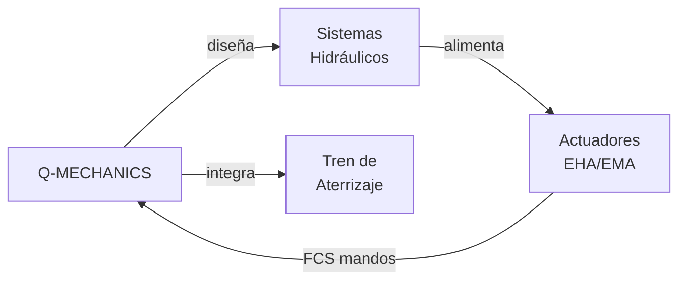

# Q-MECHANICS — Hidráulica, Actuadores y Sistemas Mecánicos
> *El músculo de la aeronave: actuadores de alta precisión, sistemas hidráulicos y mecánica de misión crítica.*

**Identificador:** GQAOA-ORG-QDIV-Q-MECHANICS-001
**Versión:** 1.0.0 · **Fecha:** 25 de abril de 2026 · **Estado:** α

---

## 1. Misión y Alcance

Q-MECHANICS es la división técnica responsable del diseño, integración y certificación de todos los sistemas mecánicos y de actuación de la aeronave GQAOA, incluyendo los sistemas hidráulicos, los actuadores electromecánicos y electrohidrostáticos del FCS, los sistemas del tren de aterrizaje, el sistema de puertas y el sistema de escape de emergencia. Su alcance cubre también los sistemas de frenado, dirección y maniobra en tierra.

La división actúa como el nexo entre las necesidades aerodinámicas (Q-AIR) y la ejecución física de los mandos de vuelo, garantizando que los actuadores del FCS cumplan con los requisitos de fuerza, deflexión, velocidad y redundancia establecidos en las especificaciones de Q-AIR. Trabaja en estrecha colaboración con Q-GREENTECH para la electrificación de sistemas de potencia y con Q-STRUCTURES para la integración de actuadores en la estructura primaria.

---

## 2. Responsabilidades Clave

- **Sistemas hidráulicos:** Diseño, análisis y certificación de los sistemas hidráulicos de la aeronave (3,000/5,000 psi), incluyendo generación, distribución, acumuladores y sistemas de emergencia.
- **Actuadores FCS:** Diseño y cualificación de los Electro-Hydrostatic Actuators (EHA) y Electro-Mechanical Actuators (EMA) para superficies de control primarias y secundarias.
- **Tren de aterrizaje:** Diseño e integración del sistema de tren de aterrizaje principal y de nariz, incluyendo extensión/retracción, amortiguadores, frenos y sistema TPIS.
- **Sistemas de puertas y escotillas:** Diseño mecánico de puertas de pasajeros, emergencia, cargo y escotillas de acceso, incluyendo mecanismos de bloqueo y sistemas de apertura de emergencia.
- **Sistemas de frenado y dirección:** Especificación e integración del sistema de frenos de carbono/electromecánico y del sistema de dirección de nariz (NWS).
- **Gestión de fluidos y sellados:** Definición de especificaciones de fluidos hidráulicos, sellados, tuberías y accesorios para las condiciones ambientales del ciclo de vida.
- **Redundancia y seguridad (DAL):** Garantizar la arquitectura redundante requerida por CS-25 para todos los sistemas de control de vuelo y críticos de seguridad.
- **Integración en estructura:** Coordinación con Q-STRUCTURES para el paso de tuberías, instalación de actuadores y gestión de las cargas de reacción.

---

## 3. Entregables Clave

| ID | Descripción | Tipo | Estado |
|----|-------------|------|--------|
| Q-MECHANICS-01-HYD-SYS-SPEC.md | Especificación del sistema hidráulico (generación, distribución, emergencia) | MD | α |
| Q-MECHANICS-02-FCS-ACTUATOR-SPEC.xlsx | Especificación de actuadores FCS (EHA/EMA) — fuerza, velocidad, redundancia | XLSX | α |
| Q-MECHANICS-03-LANDING-GEAR-SPEC.md | Especificación del sistema de tren de aterrizaje (principal y nariz) | MD | β |
| Q-MECHANICS-04-DOORS-SPEC.md | Especificación de sistemas de puertas y escotillas | MD | β |
| Q-MECHANICS-05-BRAKE-NWS-SPEC.md | Especificación de sistema de frenos y dirección de nariz | MD | β |
| Q-MECHANICS-06-FMECA-MECHANICAL.xlsx | FMECA de sistemas mecánicos críticos (DAL A/B) | XLSX | β |
| Q-MECHANICS-07-HYDRAULIC-TEST-PLAN.md | Plan de ensayos de sistemas hidráulicos (rig test + integración) | MD | β |

---

## 4. RACI de Dominio

| Actividad | Q-MECHANICS Lead | Co-Q-Divisions (C) | ORB Support (C/I) |
|-----------|-----------------|-------------------|-------------------|
| Diseño sistema hidráulico | **A**/R | Q-GREENTECH (C), Q-AIR (C) | ORB-PMO (I) |
| Especificación actuadores FCS | **A**/R | Q-AIR (R), Q-STRUCTURES (C) | ORB-LEG (I) |
| Sistema tren de aterrizaje | **A**/R | Q-STRUCTURES (C), Q-SCIRES (C) | ORB-LEG (C) |
| FMECA sistemas mecánicos | **A**/R | Q-SCIRES (R), Q-AIR (C) | ORB-LEG (C) |
| Ensayos rig de sistemas mecánicos | **A**/R | Q-SCIRES (R), Q-INDUSTRY (C) | ORB-PMO (I) |
| Integración actuadores en estructura | **A**/R | Q-STRUCTURES (R), Q-INDUSTRY (C) | ORB-PMO (I) |
| Sistemas de puertas y emergencia | **A**/R | Q-STRUCTURES (C), Q-SCIRES (C) | ORB-LEG (C) |
| Electrificación de sistemas (EMA/EHA) | **A**/R | Q-GREENTECH (R), Q-AIR (C) | ORB-PMO (I) |

---

## 5. Interfaces Clave

### Con otras Q-Divisions

| Q-Division | Qué se intercambia | Dirección |
|------------|-------------------|-----------|
| Q-AIR | Requisitos de fuerza/velocidad/deflexión de actuadores FCS; cargas de reacción | Q-AIR → Q-MECH |
| Q-GREENTECH | Especificaciones eléctricas de alimentación de actuadores EHA/EMA; gestión térmica | Bidireccional |
| Q-STRUCTURES | Instalación de actuadores; cargas de reacción en estructura; paso de tuberías | Bidireccional |
| Q-INDUSTRY | Procesos de fabricación e instalación de sistemas mecánicos en FAL | Q-MECH → Q-IND |
| Q-GROUND | Procedimientos de mantenimiento de sistemas mecánicos; GSE especializado (jacks, rigs) | Q-MECH → Q-GROUND |
| Q-SCIRES | Ensayos de cualificación de actuadores; FMECA y FTA de sistemas mecánicos | Bidireccional |

### Con unidades ORB

| ORB Unit | Naturaleza de la interacción |
|----------|------------------------------|
| ORB-LEG | Cumplimiento CS-25 Subpart F/G (tren de aterrizaje, mandos de vuelo); DAL requirements |
| ORB-PROC | Cualificación de proveedores de actuadores, tuberías hidráulicas y fluidos |
| ORB-PMO | Hitos de congelado de baseline mecánico; cronograma de ensayos de rig |
| ORB-FIN | Presupuesto de ensayos mecánicos; CAPEX en instalaciones de rig de actuadores |

---

## 6. KPIs del Dominio

| KPI | Objetivo | Fuente |
|-----|----------|--------|
| Pérdida de potencia hidráulica total (FMECA) | Probabilidad ≤ 10⁻⁹ /FH | Q-MECHANICS-06-FMECA-MECHANICAL |
| Tiempo de extensión del tren de aterrizaje (gravedad libre) | ≤ 10 segundos | Q-MECHANICS-03-LANDING-GEAR-SPEC |
| Eficiencia energética EHA vs. sistema hidráulico convencional | ≥ 20% de ahorro energético | Q-MECHANICS-02-FCS-ACTUATOR-SPEC |
| Cobertura FMECA sistemas mecánicos DAL A/B | 100% | Q-MECHANICS-06-FMECA-MECHANICAL |
| Presión operativa del sistema hidráulico principal | 5,000 psi (345 bar) ±2% | Q-MECHANICS-01-HYD-SYS-SPEC |

---

## 7. Riesgos Específicos

| Riesgo | Impacto | Probabilidad | Mitigación |
|--------|---------|--------------|------------|
| Fallo de actuador EHA durante fase de pruebas en vuelo | Crítico | Baja | Redundancia triple (3× EHA por superficie); FTA riguroso desde diseño conceptual |
| Incompatibilidad de fluido hidráulico nuevo con materiales de sellado | Medio | Media | Ensayos de compatibilidad de materiales por Q-SCIRES antes de congelado de baseline |
| Peso excesivo del sistema de tren de aterrizaje en arquitectura BWB | Alto | Media | MDO temprano de integración tren-estructura con Q-STRUCTURES |
| Retraso en cualificación de actuadores EMA de alta potencia | Alto | Media | Proveedores alternativos pre-cualificados; desarrollo paralelo de prototipos |

---

## 8. Referencias

- [Matriz RACI Maestra Q-Divisions](../Readme.md)
- [Documento Organizacional Maestro GQAOA](../../README.md)
- [AMPEL360-BWB-Q100 Docs](../../../programs/AMPEL360/AMPEL360-BWB-Q100/Docs/readme.md)
- [CSDB S1000D Validator](../../../CSDB/s1000d_validator.py)

---

**[FIN DEL DOCUMENTO]**
