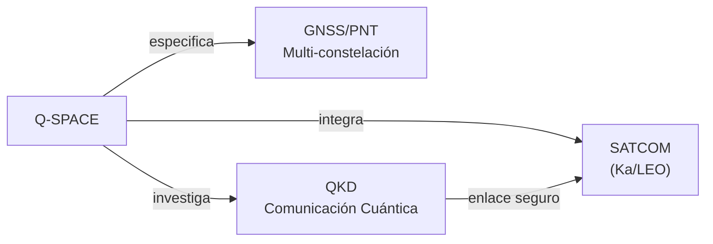

# Q-SPACE — Sistemas Satelitales, Espacio y Comunicaciones
> *El nexo entre el cielo y el espacio: comunicaciones de misión crítica, satélites y conectividad cuántica.*

**Identificador:** GQAOA-ORG-QDIV-Q-SPACE-001
**Versión:** 1.0.0 · **Fecha:** 25 de abril de 2026 · **Estado:** α

---

## 1. Misión y Alcance

Q-SPACE es la división técnica responsable del diseño, integración y operación de todos los sistemas de comunicaciones aéreas vía satélite (SATCOM), enlaces de datos aeronáuticos (ACARS/ADS-B/Link 16), y sistemas de posicionamiento y navegación de precisión (GNSS/PNT) del programa GQAOA. Su alcance se extiende también a la integración de sistemas de comunicación cuántica (QKD — Quantum Key Distribution) y al soporte de la infraestructura del Continente Eternity (EC) para los enlaces espaciales.

Q-SPACE actúa como la división enlace entre las capacidades aeronáuticas y la infraestructura espacial europea, coordinando con Q-HPC (integración de QPU y QKD), Q-DATAGOV (ICDs de comunicaciones) y ORB-IT (infraestructura de tierra).

---

## 2. Responsabilidades Clave

- **Sistemas SATCOM aeronáuticos:** Diseño e integración de terminales SATCOM de banda Ka/Ku/LEO para comunicaciones de voz y datos de alta velocidad en vuelo.
- **Enlace de datos aeronáuticos:** Gestión de los sistemas ADS-B, ACARS, VHF/HF data link y LDACS para vigilancia y comunicaciones operacionales.
- **GNSS/PNT de precisión:** Integración de receptores GNSS multi-constelación (GPS/Galileo/GLONASS/BeiDou) con aumentación SBAS/GBAS para operaciones PBN.
- **Comunicaciones cuánticas (QKD):** Investigación e integración de canales QKD sobre infraestructura SATCOM para ciberseguridad de comunicaciones de misión crítica.
- **Compatibilidad electromagnética (EMC/EMI):** Responsable del plan de gestión de EMC/EMI para todos los sistemas de radiofrecuencia embarcados.
- **Interfaces con ATM (Air Traffic Management):** Integración con los sistemas de gestión del tráfico aéreo SESAR/NextGen; participación en estándares EUROCAE/RTCA.
- **Infraestructura de tierra de comunicaciones:** Coordinación con ORB-IT para las estaciones de tierra, NOC (Network Operations Center) y redundancia de comunicaciones.
- **Seguridad de comunicaciones:** Gestión de la seguridad de los enlaces de datos aeronáuticos conforme a ED-202A (ARINC 811) y normativa ICAO.

---

## 3. Entregables Clave

| ID | Descripción | Tipo | Estado |
|----|-------------|------|--------|
| Q-SPACE-01-SATCOM-SPEC.md | Especificación del sistema SATCOM aeronáutico (banda Ka/LEO) | MD | α |
| Q-SPACE-02-GNSS-PNT-SPEC.md | Especificación de sistemas GNSS/PNT multi-constelación | MD | α |
| Q-SPACE-03-QKD-INTEGRATION-PLAN.md | Plan de integración de comunicaciones cuánticas (QKD) | MD | β |
| Q-SPACE-04-EMC-PLAN.md | Plan de gestión de compatibilidad electromagnética (EMC/EMI) | MD | β |
| Q-SPACE-05-ATM-INTERFACE-ICD.md | ICD de interfaz con sistemas ATM (ADS-B/LDACS/ACARS) | MD | α |
| Q-SPACE-06-COMMS-SECURITY-ARCH.md | Arquitectura de seguridad de comunicaciones (ED-202A) | MD | β |

---

## 4. RACI de Dominio

| Actividad | Q-SPACE Lead | Co-Q-Divisions (C) | ORB Support (C/I) |
|-----------|-------------|-------------------|-------------------|
| Diseño sistema SATCOM aeronáutico | **A**/R | Q-HPC (C), Q-MECHANICS (C) | ORB-IT (C), ORB-LEG (C) |
| Integración GNSS/PNT | **A**/R | Q-AIR (C), Q-HPC (C) | ORB-LEG (C) |
| Plan integración QKD | **A**/R | Q-HPC (R), Q-DATAGOV (C) | ORB-IT (C), ORB-LEG (C) |
| Gestión EMC/EMI embarcada | **A**/R | Q-MECHANICS (C), Q-AIR (C) | ORB-LEG (I) |
| ICD interfaz ATM (ADS-B/ACARS) | **A**/R | Q-DATAGOV (R), Q-AIR (C) | ORB-LEG (C), ORB-PMO (I) |
| Seguridad comunicaciones ED-202A | **A**/R | Q-HPC (C), Q-DATAGOV (C) | ORB-IT (C), ORB-LEG (C) |

---

## 5. Interfaces Clave

### Con otras Q-Divisions

| Q-Division | Qué se intercambia | Dirección |
|------------|-------------------|-----------|
| Q-HPC | Integración QPU/QKD; procesamiento de señales satelitales con IA | Bidireccional |
| Q-AIR | Requisitos de FMS sobre datos GNSS/PNT; impacto EMI en FCS | Q-SPACE → Q-AIR |
| Q-DATAGOV | ICDs de comunicaciones publicados en CSDB | Q-SPACE → Q-DATAGOV |
| Q-MECHANICS | Instalación física de antenas y terminales en estructura | Q-SPACE → Q-MECH |
| Q-GROUND | Infraestructura de NOC terrestre y estaciones de tierra | Bidireccional |

### Con unidades ORB

| ORB Unit | Naturaleza de la interacción |
|----------|------------------------------|
| ORB-IT | Infraestructura de NOC, servidores de comunicaciones, seguridad de red |
| ORB-LEG | Licencias de frecuencia (ITU/EASA), cumplimiento EUROCAE/RTCA, normativa ICAO |
| ORB-PMO | Hitos de certificación de sistemas de comunicación; cronograma de integración |
| ORB-MKTG | Capacidades de conectividad en vuelo como argumento de venta (passenger Wi-Fi) |

---

## 6. KPIs del Dominio

| KPI | Objetivo | Fuente |
|-----|----------|--------|
| Disponibilidad SATCOM en ruta (en vuelo) | ≥ 99.9% | Q-SPACE-01-SATCOM-SPEC |
| Precisión GNSS/PNT (RNP AR) | ≤ 0.1 NM (RNP 0.1) | Q-SPACE-02-GNSS-PNT-SPEC |
| TRL integración QKD para comunicaciones críticas | TRL ≥ 4 en 2034 | Q-SPACE-03-QKD-INTEGRATION-PLAN |
| Tiempo de certificación EMC (DO-160G) | ≤ 18 meses desde freeze aviónica | Q-SPACE-04-EMC-PLAN |
| Latencia enlace datos aeronáuticos (ADS-B out) | ≤ 500 ms | Q-SPACE-05-ATM-INTERFACE-ICD |

---

## 7. Riesgos Específicos

| Riesgo | Impacto | Probabilidad | Mitigación |
|--------|---------|--------------|------------|
| Interferencia de RF entre sistemas SATCOM y FCS | Alto | Media | Análisis EMC/EMI desde diseño conceptual; ensayos HIRF tempranos |
| Retraso en aprobación de licencias de frecuencia ITU | Medio | Media | Proceso de licenciamiento iniciado 3 años antes del EIS con ORB-LEG |
| Vulnerabilidad de spoofing GNSS | Alto | Media | Integración de receptor GNSS con anti-spoofing; respaldo INS/IRS |
| Madurez insuficiente de QKD aeronáutico para certificación | Medio | Alta | Tratado como tecnología complementaria no crítica en primera fase |

---

## 8. Referencias

- [Matriz RACI Maestra Q-Divisions](../Readme.md)
- [Documento Organizacional Maestro GQAOA](../../README.md)
- [AMPEL360-BWB-Q100 Docs](../../../programs/AMPEL360/AMPEL360-BWB-Q100/Docs/readme.md)
- [Eternity Continent Infrastructure](../../Eternity-Continent-Infrastructure.md)

---

**[FIN DEL DOCUMENTO]**
