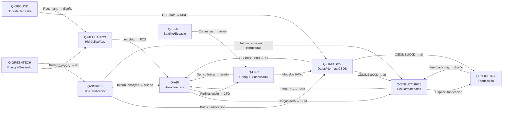

# Q-Divisions — Matriz RACI Maestra
## GAIA QUANTUM AMPEL OPT-INS ARCHITECTURE, INC. (GQAOA, INC.)

> **⚠️ AVISO LEGAL / DISCLAIMER**
> Este documento forma parte del programa conceptual/ficticio **GQAOA** diseñado por **Amedeo Pelliccia** como marco de referencia de ingeniería aeroespacial avanzada y gobernanza organizacional. Todo el contenido es de carácter ficticio y educativo. Ningún nombre, cifra ni referencia debe interpretarse como información de empresa real, dato financiero real ni documento regulatorio vinculante.

**Identificador:** GQAOA-ORG-QDIV-RACI-MASTER-001
**Versión:** 1.0.0
**Fecha:** 25 de abril de 2026
**Clasificación:** Confidencial del Consorcio
**Autor:** Comité de Gobernanza Técnica — Q-Divisions Council
**Estado:** α (operacional_estable)

---

## 1. Misión y Alcance

Las **Q-Divisions** constituyen el **brazo de ejecución técnica** del programa GQAOA. Son las unidades responsables de la ingeniería, el desarrollo, la integración y la validación de todos los subsistemas y tecnologías que componen las aeronaves y sistemas del consorcio. A diferencia de las **ORB-Functions** (funciones empresariales transversales como Finanzas, RRHH, Legal), las Q-Divisions operan en el dominio técnico-científico y reportan directamente al Comité Técnico Ejecutivo (CTE).

Cada Q-Division es responsable de un dominio tecnológico específico y actúa como propietaria (*Accountable*) de los entregables técnicos de su dominio, colaborando estrechamente con otras Q-Divisions y recibiendo soporte de las ORB-Functions para asuntos empresariales, regulatorios y de recursos.

La estructura de 10 Q-Divisions cubre el espectro completo del ciclo de vida del programa, desde la investigación conceptual hasta el retiro y la economía circular, garantizando la trazabilidad RACI en cada proceso y artefacto técnico del programa.

---

## 2. Índice de Q-Divisions

| # | Código | Dominio | Carpeta |
|---|--------|---------|---------|
| 1 | **Q-AIR** | Aerodinámica, Control de Vuelo | [./Q-AIR/](./Q-AIR/) |
| 2 | **Q-GREENTECH** | Sistemas de Energía, Baterías, Sostenibilidad | [./Q-GREENTECH/](./Q-GREENTECH/) |
| 3 | **Q-STRUCTURES** | Célula, Materiales, Integridad Estructural | [./Q-STRUCTURES/](./Q-STRUCTURES/) |
| 4 | **Q-HPC** | Computación de Alto Rendimiento, Cuántica, IA/ML | [./Q-HPC/](./Q-HPC/) |
| 5 | **Q-DATAGOV** | Gobierno del Dato, Normas, Documentación, CSDB | [./Q-DATAGOV/](./Q-DATAGOV/) |
| 6 | **Q-INDUSTRY** | Fabricación, Ensamblaje, Producción | [./Q-INDUSTRY/](./Q-INDUSTRY/) |
| 7 | **Q-SPACE** | Sistemas Satelitales, Espacio, Comunicaciones | [./Q-SPACE/](./Q-SPACE/) |
| 8 | **Q-GROUND** | Soporte Terrestre, Mantenimiento, GSE | [./Q-GROUND/](./Q-GROUND/) |
| 9 | **Q-MECHANICS** | Hidráulica, Actuadores, Sistemas Mecánicos | [./Q-MECHANICS/](./Q-MECHANICS/) |
| 10 | **Q-SCIRES** | Investigación Científica, Ensayos, Certificación | [./Q-SCIRES/](./Q-SCIRES/) |

---

## 3. Matriz RACI Maestra

**Leyenda de roles:** R = Responsable (ejecuta) · **A** = Accountable (rinde cuentas, uno por fila) · C = Consultado · I = Informado

> Las celdas vacías indican que la Q-Division no tiene participación directa en esa actividad.

### 3.1 Fase: Concepto (CON)

| # | Actividad | Q-AIR | Q-GREENTECH | Q-STRUCTURES | Q-HPC | Q-DATAGOV | Q-INDUSTRY | Q-SPACE | Q-GROUND | Q-MECHANICS | Q-SCIRES | ORB Support |
|---|-----------|-------|-------------|--------------|-------|-----------|------------|---------|----------|-------------|----------|-------------|
| CON-01 | Análisis de mercado y KMR definition | C | C | C | C | C | C | C | C | C | **A**/R | (ORB-MKTG, ORB-PMO) |
| CON-02 | Concepto de Operaciones (ConOps) | **A**/R | R | C | C | C | I | R | R | C | R | (ORB-PMO) |
| CON-03 | Factibilidad tecnológica (TRL roadmap) | C | R | C | R | C | C | C | C | C | **A**/R | (ORB-PMO, ORB-FIN) |
| CON-04 | Concepto de sostenibilidad (LCA inicial) | C | **A**/R | C | C | C | C | C | C | C | R | (ORB-CSR, ORB-LEG) |
| CON-05 | Definición de requisitos de misión | **A**/R | R | R | R | R | C | R | R | R | R | (ORB-PMO, ORB-LEG) |

### 3.2 Fase: Diseño (DES)

| # | Actividad | Q-AIR | Q-GREENTECH | Q-STRUCTURES | Q-HPC | Q-DATAGOV | Q-INDUSTRY | Q-SPACE | Q-GROUND | Q-MECHANICS | Q-SCIRES | ORB Support |
|---|-----------|-------|-------------|--------------|-------|-----------|------------|---------|----------|-------------|----------|-------------|
| DES-01 | Arquitectura del sistema | **A**/R | R | R | R | R | C | R | C | R | C | (ORB-PMO) |
| DES-02 | Diseño aerodinámico (CAD/CFD) | **A**/R | C | R | R | I | I | I | I | C | R | (ORB-PMO) |
| DES-03 | Diseño estructural (FEM/MDO) | C | C | **A**/R | R | I | R | I | I | R | R | (ORB-PMO) |
| DES-04 | Propulsión y sistemas de energía | C | **A**/R | C | C | I | C | C | C | R | R | (ORB-PMO) |
| DES-05 | Integración aviónica y HPC | R | C | C | **A**/R | R | C | R | C | C | C | (ORB-IT) |
| DES-06 | Integración de sistemas cuánticos (QPU) | C | C | C | **A**/R | R | I | C | I | C | R | (ORB-IT, ORB-LEG) |
| DES-07 | Interface Control Documents (ICDs) | R | R | R | R | **A**/R | R | R | R | R | C | (ORB-PMO) |
| DES-08 | Arquitectura de ciberseguridad | C | C | C | **A**/R | R | C | R | C | C | C | (ORB-IT, ORB-LEG) |

### 3.3 Fase: Ensayos / Test (TST)

| # | Actividad | Q-AIR | Q-GREENTECH | Q-STRUCTURES | Q-HPC | Q-DATAGOV | Q-INDUSTRY | Q-SPACE | Q-GROUND | Q-MECHANICS | Q-SCIRES | ORB Support |
|---|-----------|-------|-------------|--------------|-------|-----------|------------|---------|----------|-------------|----------|-------------|
| TST-01 | Plan maestro de ensayos | C | C | C | C | R | C | C | C | C | **A**/R | (ORB-PMO, ORB-LEG) |
| TST-02 | Ensayos en túnel de viento y CFD | **A**/R | C | C | R | I | I | I | I | C | R | (ORB-PMO) |
| TST-03 | Ensayos estructurales (estático/fatiga) | C | C | **A**/R | C | I | R | I | C | R | R | (ORB-PMO) |
| TST-04 | V&V software (DO-178C) | C | C | C | **A**/R | R | C | C | C | C | R | (ORB-LEG, ORB-IT) |
| TST-05 | V&V hardware (DO-254) | C | R | C | **A**/R | R | C | C | C | R | R | (ORB-LEG) |
| TST-06 | Validación de algoritmos cuánticos | I | C | I | **A**/R | R | I | C | I | I | R | (ORB-IT) |

### 3.4 Fase: Certificación (CERT)

| # | Actividad | Q-AIR | Q-GREENTECH | Q-STRUCTURES | Q-HPC | Q-DATAGOV | Q-INDUSTRY | Q-SPACE | Q-GROUND | Q-MECHANICS | Q-SCIRES | ORB Support |
|---|-----------|-------|-------------|--------------|-------|-----------|------------|---------|----------|-------------|----------|-------------|
| CERT-01 | Matriz de conformidad regulatoria | C | C | C | C | **A**/R | C | C | C | C | R | (ORB-LEG, ORB-PMO) |
| CERT-02 | Certificación de tipo (Part 21J / EASA) | R | R | R | C | R | C | I | I | R | **A**/R | (ORB-LEG, ORB-PMO) |
| CERT-03 | Aprobación organización de producción (Part 21G/145) | C | C | C | C | R | **A**/R | I | R | R | R | (ORB-LEG, ORB-PROC) |
| CERT-04 | Certificación ESG/ISO 14040 (ACV) | C | **A**/R | C | C | R | C | C | C | C | R | (ORB-CSR, ORB-LEG) |

### 3.5 Fase: Producción (PRD)

| # | Actividad | Q-AIR | Q-GREENTECH | Q-STRUCTURES | Q-HPC | Q-DATAGOV | Q-INDUSTRY | Q-SPACE | Q-GROUND | Q-MECHANICS | Q-SCIRES | ORB Support |
|---|-----------|-------|-------------|--------------|-------|-----------|------------|---------|----------|-------------|----------|-------------|
| PRD-01 | Planificación de fabricación (MPS/MRP) | C | C | C | C | R | **A**/R | I | C | R | C | (ORB-PROC, ORB-FIN) |
| PRD-02 | Ensamblaje final (FAL) | C | C | R | C | I | **A**/R | I | R | R | C | (ORB-PROC) |
| PRD-03 | Control de calidad (AOG / SPC) | C | C | R | C | R | **A**/R | I | R | R | R | (ORB-PROC, ORB-LEG) |
| PRD-04 | Cualificación de proveedores | C | C | C | C | R | **A**/R | I | C | C | R | (ORB-PROC, ORB-LEG) |

### 3.6 Fase: Operación / Soporte (OPS)

| # | Actividad | Q-AIR | Q-GREENTECH | Q-STRUCTURES | Q-HPC | Q-DATAGOV | Q-INDUSTRY | Q-SPACE | Q-GROUND | Q-MECHANICS | Q-SCIRES | ORB Support |
|---|-----------|-------|-------------|--------------|-------|-----------|------------|---------|----------|-------------|----------|-------------|
| OPS-01 | Programa de mantenimiento (MRO) | C | C | R | C | R | C | C | **A**/R | R | R | (ORB-PROC, ORB-FIN) |
| OPS-02 | Equipos de soporte terrestre (GSE) | C | R | C | C | I | R | C | **A**/R | R | C | (ORB-PROC) |
| OPS-03 | Formación y entrenamiento operacional | C | C | C | C | R | C | C | **A**/R | C | R | (ORB-HR, ORB-PMO) |
| OPS-04 | Publicaciones técnicas (S1000D / CSDB) | C | C | C | C | **A**/R | C | C | R | C | C | (ORB-PMO) |
| OPS-05 | Monitorización en servicio (BOB DA) | R | R | R | **A**/R | R | C | R | R | R | R | (ORB-IT, ORB-PMO) |

### 3.7 Fase: Retiro y Economía Circular (RET)

| # | Actividad | Q-AIR | Q-GREENTECH | Q-STRUCTURES | Q-HPC | Q-DATAGOV | Q-INDUSTRY | Q-SPACE | Q-GROUND | Q-MECHANICS | Q-SCIRES | ORB Support |
|---|-----------|-------|-------------|--------------|-------|-----------|------------|---------|----------|-------------|----------|-------------|
| RET-01 | Evaluación fin de vida (EoL assessment) | C | R | C | C | R | C | C | C | C | **A**/R | (ORB-CSR, ORB-LEG) |
| RET-02 | Restauración y circularidad (LUTNDR) | C | **A**/R | R | C | R | R | C | C | R | R | (ORB-CSR, ORB-PROC) |
| RET-03 | Recuperación de materiales | C | R | **A**/R | C | I | R | C | C | R | R | (ORB-CSR, ORB-PROC) |

---

## 4. Leyenda RACI

| Rol | Símbolo | Descripción |
|-----|---------|-------------|
| Responsable | **R** | Ejecuta la actividad. Puede haber múltiples R por fila. |
| Accountable | **A** | Rinde cuentas del resultado. **Exactamente uno por fila.** Toma la decisión final. |
| Consultado | **C** | Proporciona input antes o durante la ejecución. Comunicación bidireccional. |
| Informado | **I** | Recibe información sobre el resultado. Comunicación unidireccional. |

> **Nota:** Cuando una celda muestra `**A**/R`, la división es simultáneamente Accountable y ejecutor principal.

---

## 5. Diagrama de Interacción entre Q-Divisions

---

## 6. Cadencia de Gobernanza

| Foro | Frecuencia | Presidente | Participantes | Outputs |
|------|------------|------------|---------------|---------|
| Q-Council (Consejo de Q-Divisions) | Quincenal | CTO | Directores de las 10 Q-Divisions | Decisiones técnicas cross-division, resolución de conflictos RACI |
| IPT Review (Integrated Product Team) | Semanal | Director Q propietario | Q-Divisions afectadas + ORB-PMO | Avance de entregables, gestión de riesgos técnicos |
| Program Management Review (PMR) | Mensual | CEO / COO | Todos los Directores Q + ORB-Functions | Estado del programa, presupuesto, KPIs |
| Technical Baseline Review (TBR) | Por fase | CTO + ORB-PMO | Q-Divisions relevantes + ORB-LEG | Congelado de baseline técnico |
| Sustainability Checkpoint | Trimestral | Q-GREENTECH Director | Q-SCIRES, ORB-CSR, ORB-LEG | Informe ACV, KPIs ambientales |
| CSDB / Data Governance Board | Mensual | Q-DATAGOV Director | Todas las Q-Divisions + ORB-IT | Estado CSDB, gestión de datos, S1000D |

---

## 7. Distribución de Documentos por Q-Division

Para la tabla completa de distribución de documentos técnicos por Q-Division y tipo de artefacto, consultar:

→ **[`../../../programs/AMPEL360/AMPEL360-BWB-Q100/Docs/readme.md`](../../../programs/AMPEL360/AMPEL360-BWB-Q100/Docs/readme.md)**

Resumen de documentos por Q-Division (AMPEL360-BWB-Q100):

| Q-Division | N.º Documentos | Tipos principales |
|------------|---------------|-------------------|
| Q-DATAGOV | 15 | Standards, CSDB schemas, S1000D DMs |
| Q-STRUCTURES | 12 | FEM specs, material specs, ICD |
| Q-AIR | 10 | Aero specs, CFD reports, FCS design |
| Q-GREENTECH | 10 | Energy sys., battery specs, ACV |
| Q-INDUSTRY | 12 | MPI, assembly WI, BOM |
| Q-HPC | 8 | QPU specs, AI/ML models, SW arch |
| Q-MECHANICS | 8 | Hydraulic specs, actuator datasheets |
| Q-GROUND | 8 | GSE specs, MRO procedures |
| Q-SPACE | 6 | Sat-comm ICD, orbital ops |
| Q-SCIRES | 6 | Test plans, cert. matrices |

---

**[FIN DEL DOCUMENTO]**
