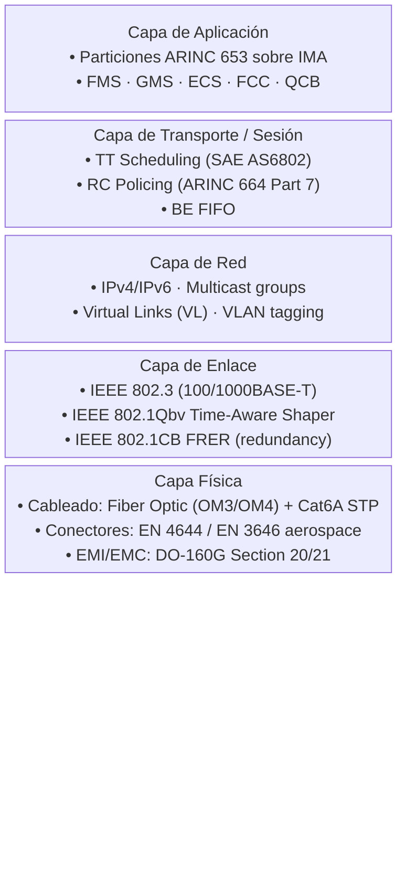
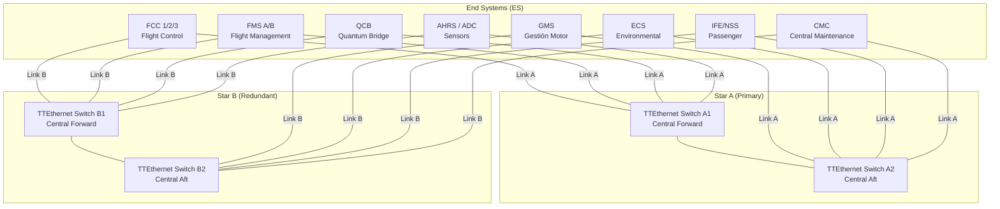
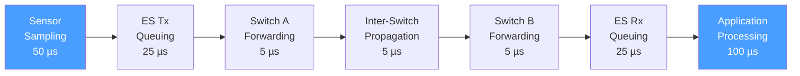
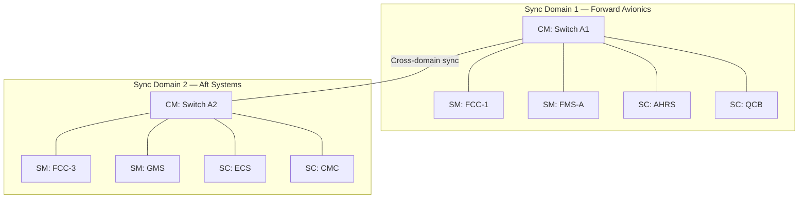
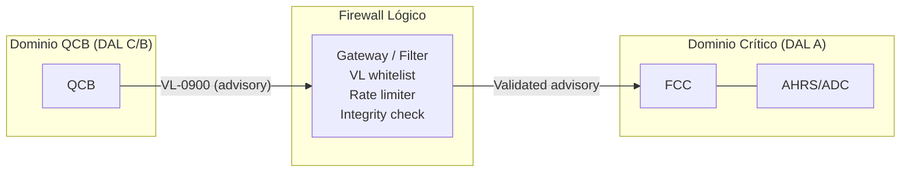
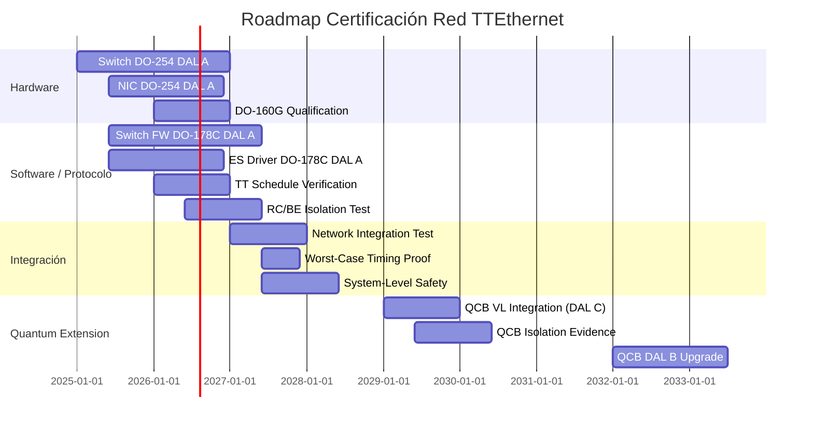

# AMPEL360 BWB-Q100 — TIME-TRIGGERED ETHERNET INFRASTRUCTURE

**Documento ID:** Q100-ALI-DP-ATA-042-20-00-CON-001  
**Tipo:** ALI-DP (ALICE Digital Page)  
**Dominio:** ATA-042 (Aviónica Modular Integrada — Redes Determinísticas)  
**Fase:** CON (Conceptual)  
**Versión:** 1.0.0  
**Fecha:** 2025-01-25  
**Clasificación:** GAIA QAO ADVENT — Confidencial  

---

## RESUMEN EJECUTIVO

Este documento define la arquitectura de la red Time-Triggered Ethernet (TTEthernet) para el sistema de aviónica modular integrada (IMA) del AMPEL360 BWB-Q100. La red TTEthernet constituye la columna vertebral de comunicación determinística que interconecta todos los módulos IMA, sensores, actuadores y la interfaz cuántica-clásica (QCB). Se adopta el estándar SAE AS6802 sobre infraestructura Ethernet IEEE 802.3, complementado con perfiles ARINC 664 Part 7 (AFDX) para compatibilidad con sistemas de legado.

**Objetivos clave:**
- Latencia determinística end-to-end ≤ 500 µs para tráfico time-triggered (TT)
- Redundancia dual-star con recuperación < 50 µs
- Soporte de tres clases de tráfico: TT, Rate-Constrained (RC) y Best-Effort (BE)
- Preparación para integración de datos cuánticos (Quantum Data Plane, Fase 3+)
- Certificación conforme DO-178C / DO-254 / ED-12C y SAE AS6802

---

## 1. INTRODUCCIÓN

### 1.1 Propósito

La red de datos aviónica es la infraestructura Ethernet que transporta todos los flujos críticos de vuelo, misión y mantenimiento dentro de la plataforma IMA del Q100. Este documento establece los requisitos conceptuales, la topología, la política de tráfico y la estrategia de certificación para dicha red.

### 1.2 Alcance

| Aspecto | Incluido | Excluido |
|---------|----------|----------|
| Topología física y lógica | ✔ | — |
| Clases de tráfico y planificación | ✔ | — |
| Redundancia y tolerancia a fallos | ✔ | — |
| Interfaz con QCB (conceptual) | ✔ | — |
| Cyberseguridad de red | — | CYB-810-10 |
| Gestión de red determinística detallada | — | ATA-042-20-10 |
| Integración QPU completa | — | ATA-042-10-10 |

### 1.3 Documentos de Referencia

| ID | Título |
|----|--------|
| Q100-ALI-DP-ATA-042-00-00-CON-001 | IMA Architecture Quantum |
| Q100-ALI-DP-ATA-042-10-00-CON-001 | Quantum–Classical Interface |
| Q100-ALI-DP-ATA-042-20-10-CON-001 | Deterministic Network |
| Q100-ALI-DP-ATA-042-30-00-CON-001 | Redundancy Management |
| Q100-ALI-DP-ATA-042-70-00-CON-001 | Cybersecurity Framework |
| Q100-ALI-DP-ATA-000-00-00-CON-002 | Arquitectura Sistema Global |
| SAE AS6802 | Time-Triggered Ethernet |
| ARINC 664 Part 7 | AFDX / ARINC 664P7 |
| IEEE 802.1Qbv | Time-Aware Shaper |
| IEEE 802.1CB | Frame Replication & Elimination |
| DO-178C / ED-12C | Software Considerations |
| DO-254 / ED-80 | Hardware Design Assurance |

---

## 2. ARQUITECTURA DE RED TTEthernet

### 2.1 Visión de Capas



### 2.2 Topología Física: Dual-Star Redundante



### 2.3 Topología Lógica: Virtual Links

```yaml
Virtual_Link_Architecture:
  VL_Classification:
    Safety_Critical:  # DAL A
      VL_Range: "VL-0001 – VL-0999"
      Traffic_Class: "TT (Time-Triggered)"
      Bandwidth_Guarantee: "Dedicated slots"
      End_Systems:
        - "FCC → FMS"
        - "AHRS/ADC → FCC"
        - "FCC → GMS"
        - "QCB → FCC (Fase 3+, advisory only)"

    Mission_Essential:  # DAL B/C
      VL_Range: "VL-1000 – VL-3999"
      Traffic_Class: "RC (Rate-Constrained)"
      BAG_Values: [1, 2, 4, 8, 16, 32, 64, 128]  # ms
      End_Systems:
        - "FMS ↔ ECS"
        - "FMS ↔ CMC"
        - "QCB → FMS (telemetry)"

    Non_Critical:  # DAL D/E
      VL_Range: "VL-4000 – VL-8191"
      Traffic_Class: "BE (Best-Effort)"
      End_Systems:
        - "IFE/NSS ↔ Cabin Systems"
        - "CMC → Ground (via ACARS)"
        - "Health Monitoring telemetry"
```

---

## 3. CLASES DE TRÁFICO Y PLANIFICACIÓN

### 3.1 Clases de Tráfico (SAE AS6802)

| Clase | Nombre | Prioridad | Latencia Max | Jitter Max | Ejemplo |
|-------|--------|-----------|-------------|------------|---------|
| TT | Time-Triggered | Máxima | ≤ 500 µs | ≤ 1 µs | FCC ↔ sensores inerciales |
| RC | Rate-Constrained | Media | ≤ 5 ms | ≤ 500 µs | FMS ↔ ECS, CMC telemetry |
| BE | Best-Effort | Baja | Sin garantía | Sin garantía | IFE, diagnósticos |

### 3.2 Planificación de Ciclo TT

```yaml
TT_Schedule_Design:
  Cluster_Cycle: 10  # ms — período global de planificación
  Macro_Tick: 12.5  # µs — unidad mínima de tiempo
  Slots_Per_Cycle: 800  # 10 ms / 12.5 µs

  Guard_Band: 2  # macro-ticks entre TT y RC/BE
  Sync_Accuracy: "±500 ns global"

  Critical_Flows:
    FCC_Sensor_Loop:
      Period: 1.25  # ms (800 Hz)
      Payload: 128  # bytes
      Slot: "Slot 0–10 every 100 ticks"
      Redundancy: "Dual (Star A + Star B)"
      DAL: "A"

    FCC_Actuator_Cmd:
      Period: 2.5  # ms (400 Hz)
      Payload: 64  # bytes
      Slot: "Slot 12–16 every 200 ticks"
      Redundancy: "Triple (2 stars + CRC)"
      DAL: "A"

    FMS_Navigation_Update:
      Period: 10  # ms (100 Hz)
      Payload: 256  # bytes
      Slot: "Slot 20–28"
      DAL: "B"

    QCB_Advisory_Result:
      Period: 100  # ms (10 Hz)
      Payload: 512  # bytes
      Slot: "Slot 50–58 (every 10th cycle)"
      DAL: "C (advisory only)"
      Phase: "3+ (2029+)"
```

### 3.3 Presupuesto de Latencia End-to-End



| Componente | Latencia Típica | Latencia Peor Caso |
|------------|----------------|--------------------|
| Sensor sampling & encoding | 50 µs | 75 µs |
| End System Tx queuing + TAS gate | 25 µs | 50 µs |
| Switch forwarding (cut-through) | 5 µs | 8 µs |
| Inter-switch propagation (fiber) | 5 µs | 5 µs |
| Switch forwarding (2nd hop) | 5 µs | 8 µs |
| End System Rx + de-queuing | 25 µs | 50 µs |
| Application processing | 100 µs | 200 µs |
| **Total (2-hop, TT)** | **215 µs** | **396 µs** |
| **Margin vs. 500 µs req.** | **285 µs** | **104 µs ✔** |

---

## 4. SINCRONIZACIÓN DE RELOJ

### 4.1 Protocolo de Sincronización

```yaml
Clock_Synchronization:
  Protocol: "SAE AS6802 (basado en IEEE 802.1AS)"
  Architecture:
    Compression_Masters: 2  # Switches centrales por star
    Sync_Masters: 4  # End Systems designados (FCC, FMS)
    Sync_Clients: "Todos los demás End Systems"

  Parameters:
    Sync_Period: 500  # µs
    Global_Precision: "±500 ns"  # entre cualquier par de ES
    Startup_Time: "<2 s"
    Resync_After_Fault: "<10 ms"

  Fault_Tolerance:
    Max_Faulty_CMs: 1  # de 2 por star
    Max_Faulty_SMs: 1  # de 4
    Byzantine_Resilience: true  # AS6802 integration cycle
    Clique_Detection: true

  Integration_Cycle:
    Cold_Start: "Synchronous startup with listen phase"
    Integration: "New nodes join within 2 sync periods"
    Recovery: "Automatic re-integration after transient fault"
```

### 4.2 Mapa de Dominios de Sincronización



---

## 5. REDUNDANCIA Y TOLERANCIA A FALLOS

### 5.1 Estrategia de Redundancia de Red

```yaml
Network_Redundancy:
  Physical:
    Topology: "Dual-star (Star A + Star B)"
    Cabling: "Physically separated routes (left/right fuselage)"
    Connectors: "Separate connector blocks per star"

  Protocol:
    Standard: "IEEE 802.1CB (FRER)"
    Replication: "Frame replication at source ES"
    Elimination: "Duplicate discard at destination ES"
    Sequence_Recovery: "Per-stream sequence number"

  Switch_Level:
    Hot_Standby: false  # Not needed — dual active
    Failover_Time: "<50 µs (frame-level)"
    Health_Check: "Heartbeat every 100 ms"
    Fault_Isolation: "Per-port, per-VL"

  End_System_Level:
    Dual_Port: true  # One per star
    Port_Monitoring: "Link loss → instant switchover"
    Data_Validation: "CRC-32 + sequence number + freshness"
```

### 5.2 Análisis de Modos de Fallo (Resumen)

| Modo de Fallo | Probabilidad (por FH) | Efecto | Mitigación |
|---------------|----------------------|--------|------------|
| Fallo de un switch | 1 × 10⁻⁶ | Star degradada | Star redundante activa |
| Rotura de un cable | 5 × 10⁻⁷ | Link perdido | Ruta alternativa via FRER |
| Fallo bizantino de ES | 1 × 10⁻⁹ | Datos corruptos | Triple voting + CRC + AS6802 clique |
| Pérdida de sincronización | 1 × 10⁻⁸ | Drift temporal | Re-sync < 10 ms, fallback watchdog |
| Fallo dual (ambas estrellas) | < 1 × 10⁻¹² | Pérdida total de red | Dentro de presupuesto 10⁻⁹ DAL A |

---

## 6. INTERFAZ CON QUANTUM-CLASSICAL BRIDGE (QCB)

### 6.1 Integración de Datos Cuánticos (Fase 3+, 2029+)

```yaml
QCB_Network_Interface:
  Phase_1_and_2 (2025-2029):
    Status: "QCB slot reservado, sin tráfico cuántico"
    Port: "Dual 1 GbE (Star A + Star B)"
    VLs_Reserved: "VL-0900 – VL-0950"
    Traffic: "Simulación / diagnóstico only"

  Phase_3 (2029-2032):
    Status: "Advisory data path activo"
    Port: "Dual 1 GbE"
    VLs_Active:
      TT:
        VL_ID: "VL-0900"
        Period: 100  # ms
        Payload: 512  # bytes
        Content: "Quantum optimization result (advisory)"
        DAL: "C"
      RC:
        VL_ID: "VL-0910 – VL-0920"
        BAG: 32  # ms
        Payload: 1024  # bytes
        Content: "QPU telemetry, coherence metrics"

  Phase_4 (2032+):
    Status: "Deterministic quantum data path"
    Port: "Dual 10 GbE upgrade"
    VLs_Active:
      TT:
        VL_ID: "VL-0900 – VL-0905"
        Period: 10  # ms
        Payload: 2048  # bytes
        Content: "Real-time quantum optimization"
        DAL: "B → A (pending DO-178Q)"

  Fallback:
    Trigger: "Coherence < 5 ms OR error_rate > 1%"
    Action: "QCB VLs silenced, classical algorithms active"
    Transition: "<100 ms"
    VL_Traffic: "Switched to BE diagnostics only"
```

### 6.2 Aislamiento QCB-Dominio Crítico



---

## 7. ESPECIFICACIONES DE HARDWARE DE RED

### 7.1 Switches TTEthernet

```yaml
TTE_Switch_Specification:
  Quantity: 4  # SWA1, SWA2, SWB1, SWB2
  
  Form_Factor:
    Standard: "ARINC 600 2-MCU module"
    Weight: "≤ 3.5 kg per switch"
    Power: "≤ 50 W per switch"
    Cooling: "Forced air (IMA rack)"

  Ports:
    Total: 24  # per switch
    Speed: "1 Gbps (100 Mbps legacy mode available)"
    Medium: "12× Fiber Optic + 12× Cat6A STP"
    
  Performance:
    Forwarding_Latency: "≤ 5 µs (cut-through)"
    TT_Slots: "≥ 4096 per port"
    VL_Capacity: "≥ 4096"
    Clock_Precision: "±100 ns"

  Environmental:
    Temperature: "-40°C to +70°C (DO-160G Cat A3)"
    Vibration: "DO-160G Cat S2"
    EMI: "DO-160G Section 21 Cat M"

  Certification:
    Hardware: "DO-254 DAL A"
    Software: "DO-178C DAL A (switch firmware)"
```

### 7.2 End Systems (Interfaces de Red)

```yaml
End_System_NIC:
  Form_Factor: "Mezzanine card for IMA modules / SoC integrated"
  
  Ports: 2  # One per star
  Speed: "1 Gbps (10 Gbps optional Phase 4)"
  
  Features:
    TAS: "IEEE 802.1Qbv Time-Aware Shaper"
    FRER: "IEEE 802.1CB replication / elimination"
    PTP: "SAE AS6802 sync client"
    Timestamp: "Hardware timestamping (±50 ns)"
    
  Buffer:
    TT_Queues: 8
    RC_Queues: 8
    BE_Queues: 2
    Total_Buffer: "2 MB per port"

  Certification: "DO-254 DAL A (NIC hardware)"
```

### 7.3 Cableado y Conectores

| Segmento | Medio | Longitud Max | Conector |
|----------|-------|-------------|----------|
| Switch ↔ Switch (inter-star) | OM3 MM Fiber | 50 m | EN 4644 |
| Switch ↔ ES (avionics bay) | OM3 MM Fiber | 15 m | EN 4644 |
| Switch ↔ ES (distributed) | Cat6A STP | 30 m | EN 3646 |
| ES ↔ Sensor (short run) | Cat6A STP | 10 m | Micro D-sub |

---

## 8. CONFIGURACIÓN DE RED

### 8.1 Tabla de Configuración de Virtual Links (Extracto)

| VL-ID | Origen | Destino(s) | Clase | Período/BAG | Payload | DAL |
|-------|--------|-----------|-------|-------------|---------|-----|
| VL-0001 | AHRS-1 | FCC-1, FCC-2, FCC-3 | TT | 1.25 ms | 128 B | A |
| VL-0002 | AHRS-2 | FCC-1, FCC-2, FCC-3 | TT | 1.25 ms | 128 B | A |
| VL-0010 | ADC-1 | FCC-1, FMS-A | TT | 2.5 ms | 64 B | A |
| VL-0020 | FCC-1 | GMS-L | TT | 2.5 ms | 64 B | A |
| VL-0021 | FCC-2 | GMS-R | TT | 2.5 ms | 64 B | A |
| VL-0100 | FMS-A | FCC-1, FCC-2 | TT | 10 ms | 256 B | B |
| VL-0101 | FMS-B | FCC-2, FCC-3 | TT | 10 ms | 256 B | B |
| VL-0900 | QCB | FMS-A (advisory) | TT | 100 ms | 512 B | C |
| VL-1000 | FMS-A | ECS | RC | BAG 8 ms | 128 B | C |
| VL-1010 | CMC | FMS-A, FMS-B | RC | BAG 32 ms | 256 B | D |
| VL-4000 | IFE-Server | Cabin Zones | BE | — | 1500 B | E |
| VL-4100 | CMC | Ground (ACARS) | BE | — | 512 B | E |

### 8.2 Utilización de Ancho de Banda Estimada

| Clase de Tráfico | Ancho de Banda (por port) | % Capacidad (1 Gbps) |
|-----------------|--------------------------|----------------------|
| TT — Safety Critical | 15 Mbps | 1.5% |
| RC — Mission Essential | 50 Mbps | 5.0% |
| BE — Non-Critical | 120 Mbps | 12.0% |
| **Total utilizado** | **185 Mbps** | **18.5%** |
| **Reserva disponible** | **815 Mbps** | **81.5%** |

> **Nota:** La baja utilización es intencional para garantizar el determinismo TT y permitir la expansión futura (10 GbE en Fase 4, datos cuánticos de mayor volumen).

---

## 9. ESTRATEGIA DE CERTIFICACIÓN

### 9.1 Ruta de Certificación

```yaml
Certification_Strategy:
  Network_Equipment:
    Switches:
      Hardware: "DO-254 DAL A (ED-80)"
      Software: "DO-178C DAL A (ED-12C)"
      Environmental: "DO-160G"
    End_System_NICs:
      Hardware: "DO-254 DAL A"
      Driver_Software: "DO-178C DAL A"

  Network_Protocol:
    TT_Scheduling: "Verified by formal methods (model checking)"
    RC_Policing: "Tested per ARINC 664P7 + SAE AS6802"
    BE_Isolation: "Demonstrated non-interference"

  System_Integration:
    Standard: "ARP4754B (ED-79A)"
    Safety: "ARP4761A"
    Network_Specific:
      Worst_Case_Latency: "Verified by Network Calculus"
      Fault_Tolerance: "FMEA + Common Cause Analysis"
      Timing_Accuracy: "Measured at system integration test"

  Quantum_Extension (Fase 3+):
    QCB_VLs: "Initially DAL C (advisory)"
    Upgrade_Path: "DAL B → DAL A pending DO-178Q"
    Isolation_Proof: "Formal partitioning evidence (QCB → critical domain)"
```

### 9.2 Cronograma de Certificación de Red



---

## 10. MÉTRICAS Y KPIs

### 10.1 KPIs de Red por Fase

| Métrica | Fase 1 (2027) | Fase 2 (2029) | Fase 3 (2032) | Fase 4 (2035) |
|---------|---------------|---------------|---------------|---------------|
| Latencia TT E2E | ≤ 500 µs | ≤ 400 µs | ≤ 300 µs | ≤ 200 µs |
| Jitter TT | ≤ 1 µs | ≤ 500 ns | ≤ 200 ns | ≤ 100 ns |
| Sync Precision | ±1 µs | ±500 ns | ±200 ns | ±100 ns |
| Link Speed | 1 Gbps | 1 Gbps | 1/10 Gbps | 10 Gbps |
| VLs Activos | ~200 | ~400 | ~600 | ~800 |
| QCB VLs | 0 (reserved) | 0 (sim only) | 5–10 (advisory) | 20+ (operational) |
| Disponibilidad Red | 99.99% | 99.995% | 99.999% | 99.9999% |

---

## 11. PRÓXIMOS PASOS

### 11.1 Entregables Dependientes

1. **Q100-ALI-DP-ATA-042-20-10-CON-001** — Deterministic Network: detalle de algoritmos de planificación y Network Calculus
2. **Q100-ALI-DP-ATA-042-30-00-CON-001** — Redundancy Management: integración FRER con gestión de salud IMA
3. **Q100-ALI-DP-ATA-042-70-00-CON-001** — Cybersecurity Framework: seguridad de red post-cuántica
4. **Q100-BOB-DT-ATA-042-00-00-CON-001** — IMA System Model: modelo digital twin de la red

### 11.2 Decisiones Pendientes

| ID | Decisión | Opciones | Fecha Límite |
|----|----------|----------|--------------|
| NET-D01 | Velocidad de enlace Fase 1 | 100 Mbps vs. 1 Gbps nativo | 2025-Q2 |
| NET-D02 | Proveedor de switches TTEthernet | TTTech / Collins / Thales | 2025-Q3 |
| NET-D03 | Fiber vs. copper backbone | OM3 fiber vs. Cat6A STP | 2025-Q2 |
| NET-D04 | QCB interface speed Fase 4 | 10 GbE vs. 25 GbE | 2028-Q4 |

---

## 12. GLOSARIO

| Sigla | Significado |
|-------|-------------|
| AFDX | Avionics Full-Duplex Switched Ethernet |
| BAG | Bandwidth Allocation Gap |
| BE | Best-Effort |
| CM | Compression Master |
| DAL | Design Assurance Level |
| ES | End System |
| FCC | Flight Control Computer |
| FMS | Flight Management System |
| FRER | Frame Replication and Elimination for Reliability |
| GMS | Gestión Motor System |
| IFE | In-Flight Entertainment |
| IMA | Integrated Modular Avionics |
| QCB | Quantum-Classical Bridge |
| RC | Rate-Constrained |
| SM | Sync Master |
| TAS | Time-Aware Shaper |
| TT | Time-Triggered |
| TTEthernet | Time-Triggered Ethernet |
| VL | Virtual Link |

---

**Control de Cambios**

| Versión | Fecha | Cambios |
|---------|-------|---------|
| 1.0.0 | 2025-01-25 | Versión inicial — arquitectura conceptual TTEthernet |

**Fin del Documento**

*Documento preparado conforme al programa GAIA QAO ADVENT — AMPEL360 BWB-Q100 Fase Conceptual*
